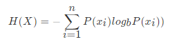

### 信息熵的定义

- H的专业术语称之为信息熵，单位为比特。

### 决策树的划分依据之一------信息增益

- 定义与公式

特征A对训练数据集D的信息增益g(D,A),定义为集合D的信息熵H(D)与特征A给定条件下D的信息条件熵H(D|A)之差，即公式为：

公式的详细解释：

> 注：信息增益表示得知特征X的信息而息的不确定性减少的程度使得类Y的信息熵减少的程度

决策树的原理不止信息增益这一种，还有其他方法。但是原理都类似。

- ID3
  - 信息增益 最大的准则
- C4.5
  - 信息增益比 最大的准则
- CART
  - 分类树: 基尼系数 最小的准则，在sklearn中可以选择划分的默认原则
  - 优势：划分更加细致（从后面例子的树显示来理解）

