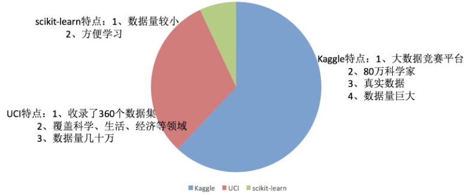

### 数据集

Kaggle网址：<https://www.kaggle.com/datasets>

UCI数据集网址： <http://archive.ics.uci.edu/ml/>

scikit-learn网址：[http://scikit-learn.org/stable/datasets/index.html#datasets](http://scikit-learn.org/stable/datasets/index.html)

ImageNet计算机视觉数据集：

### 数据集的划分

机器学习一般的数据集会划分为两个部分：

- 训练数据：用于训练，**构建模型**
- 测试数据：在模型检验时使用，用于**评估模型是否有效**

划分比例：

- 训练集：70% 80% 75%
- 测试集：30% 20% 30%

