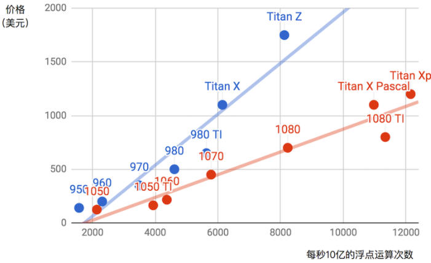

## 选择GPU

GPU的性能主要由以下3个参数构成。

1. 计算能力。通常我们关心的是32位浮点计算能力。16位浮点训练也开始流行，如果只做预测的话也可以用8位整数。
2. 显存大小。当模型越大或者训练时的批量越大时，所需要的显存就越多。
3. 显存带宽。只有当显存带宽足够时才能充分发挥计算能力。

我们可以从图中读出以下两点信息。

1. 在同一个系列里面，价格和性能大体上成正比。但后发布的型号性价比更高，如980 Ti和1080 Ti。
2. GTX 1000系列比900系列在性价比上高出2倍左右。

如果大家继续比较NVIDIA的一些其他系列，也可以发现类似的规律。据此，我们推荐大家在能力范围内尽可能买较新的GPU。

## 整机配置

通常，我们主要用GPU做深度学习训练。因此，不需要购买高端的CPU。至于整机配置，尽量参考网上推荐的中高档的配置就好。不过，考虑到GPU的功耗、散热和体积，在整机配置上也需要考虑以下3个额外因素。

1. 机箱体积。显卡尺寸较大，通常考虑较大且自带风扇的机箱。
2. 电源。购买GPU时需要查一下GPU的功耗，如50 W到300 W不等。购买电源要确保功率足够，且不会造成机房供电过载。
3. 主板的PCIe卡槽。推荐使用PCIe 3.0 16x来保证充足的GPU到内存的带宽。如果搭载多块GPU，要仔细阅读主板说明，以确保多块GPU一起使用时仍然是16倍带宽。注意，有些主板搭载4块GPU时会降到8倍甚至4倍带宽。

## 小结

- 在预算范围内，尽可能买较新的GPU。
- 整机配置需要考虑到GPU的功耗、散热和体积。