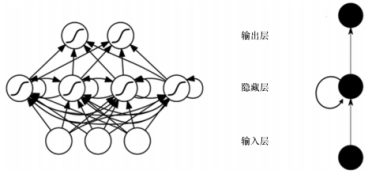
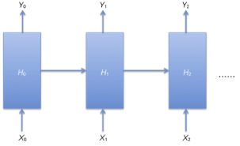

# 循环神经网络（RNN，Recurrent Neural Network）
## 1、序列模型

通常在自然语言、音频、视频以及其它序列数据的模型。

- 语音识别，输入一段语音输出对应的文字

- 情感分类，输入一段表示用户情感的文字，输出情感类别或者评分

- 机器翻译，两种语言的互相翻译

为什么在序列模型使用CNN等神经网络效果不好

- 序列数据前后之间是有很强的关联性
- 序列数据的输入输出长度不固定

## 2、循环神经网络

RNN是一种环状的深度神经网络，RNN将状态在自身网络中循环传递，常用来解决时序行为的问题。
从参数传导的角度来看，CNN架构的每层参数是直接向下传导的，不会回流而且同层参数间没有传导。而RNN在隐藏层的输出可以作为自身的输入，参数可以环状传导，RNN的结构如图。

RNN的环状特点适合解决时序空间、长短不定的问题，如语音识别、机器翻译。
RNN 训练的原理如图 ：

这张图表示RNN的隐藏层结构，X作为输入，Y为输出，H表示每个隐藏层的参数。
例如需要预测文章接下来的3个字是什么，那么这3个字对应到RNN中为3个隐藏层。我们看到每一层在做计算的时候都会考虑到前一层的隐藏层参数以及当前时间序列的输入，如H1在训练的时候考虑了H0以及X1，对应到文章预测场景，就是每预测一个字都会考虑到上下文的联系。

假设以上面的例子：对于网络当中某一时刻的公式中

1、$\mathrm{s}_t=relu(U\mathrm{x}_t+W\mathrm{s}_{t-1})​$

2、$o_{t} = softmax(V{s_t})$

## 应用场景：
语音识别、自然语言理解、机器翻译、时间序列预测、机器人控制、音乐生成、股票预测

 

