# 知识图谱（Knowledge Graph）

参考资料：

[AI技术分支——浅谈知识图谱.人人都是产品经理](http://www.woshipm.com/ai/1181709.html)

[6个方面分析：知识图谱的价值和应用.人人都是产品经理](http://www.woshipm.com/it/1088237.html)

[从10个实际项目总结：关联图谱可以怎么用（上）.人人都是产品经理](http://www.woshipm.com/it/1060345.html)

[什么是关联图谱？.人人都是产品经理](http://www.woshipm.com/it/1057792.html)

[知识图谱：专治各种“撒币”.人人都是产品经理](http://www.woshipm.com/it/912584.html)

[知识图谱在推荐系统的落地.人人都是产品经理](http://www.woshipm.com/pmd/1640689.html)【未整理】

[知识图谱在风控的应用.人人都是产品经理](http://www.woshipm.com/pd/1292806.html)【未整理】

[知识图谱技术解剖](https://www.jianshu.com/p/bd15e0f50eb9)

AI的核心是研究怎样用计算机易于处理的方式表示各种各样的知识，广义的讲，神经网络也是一种知识表示形式。

人的大脑依赖所学的知识进行思考、逻辑推理、理解语言。

AI的核心：Learning + Reasoning（学习 + 推理）

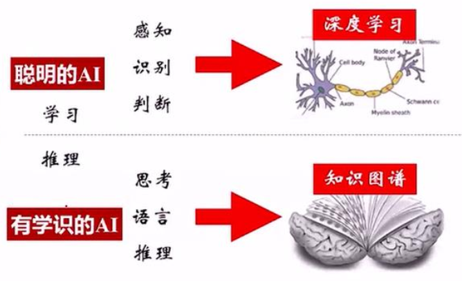

## 知识图谱的定义

知识图谱本质上是一种大规模语义网络（semantic network），是一种基于图的数据结构，由节点(Point)和边(Edge)组成，富含**实体（entity）、概念（concepts）、属性、关系（relationships）**。在知识图谱里，每个节点表示现实世界中存在的“实体”，每条边为实体与实体之间的“关系”。知识图谱是关系的最有效的表示方式。

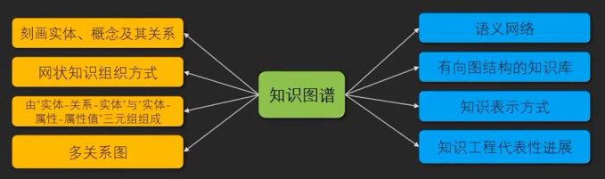

知识图谱可以用来更好的查询复杂的关联信息，从语义层面理解用户意图，改进搜索质量。

个人认为，**知识图谱最大的优势是在于对数据的描述能力非常强大**，各种机器学习算法虽然在预测能力上很不错，但是在描述能力上非常弱，知识图谱刚好填补了这部分空缺。

知识图谱的定义非常多，我这里提供一部分我自己的理解：

1.**知识图谱主要目标是用来描述真实世界中存在的各种实体和概念，以及他们之间的强关系，我们用关系去描述两个实体之间的关联**，例如姚明和火箭队之间的关系，他们的属性，我们就用“属性--值对“来刻画它的内在特性，比如说我们的人物，他有年龄、身高、体重属性。简单解释就是：**将需要的知识数据（结构化或非结构化数据）以图谱的形式进行展示**，这种简单的过程也是知识图谱的构建过程。

2.知识图谱可以通过人为构建与定义，去描述各种概念之间的弱关系，例如：“忘了订单号”和“找回订单号”之间的关系

**构建知识图谱这个过程的本质，就是让机器形成认知能力，去理解这个世界。**

### 知识的类型

知识可以分为：

- 领域知识：某个领域的特定知识
- 百科知识：涵盖各个行业、领域的通用知识
- 场景知识：在某个特定场景下或者完成某项任务的知识，如订机票、盖房子。
- 语言知识：语言层面的知识，如缩写、同义、同指
- 常识知识：大家都认可的知识，如狗有4条腿。常识是AI领域的一大难题。

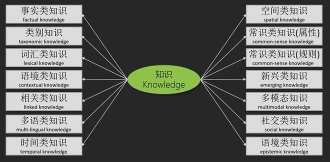

### 知识图谱的类型

通用知识图谱（General-purpose Knowledge Graph）：

- 百科知识图谱
- 概念知识图谱
- 常识知识图谱

领域知识图谱（Domain-specific Knowledge Graph）：

- 金融知识图谱
- 教育知识图谱
- 医疗知识图谱
- 公安知识图谱
- 司法知识图谱
- 农业知识图谱
- 科技知识图谱
- 健康知识图谱

场景知识图谱（Application Knowledge Graph）：

- 风控知识图谱
- 信贷知识图谱

实体知识图谱（Entity Knowledge Graph）：

- 企业知识图谱
- 商品知识图谱

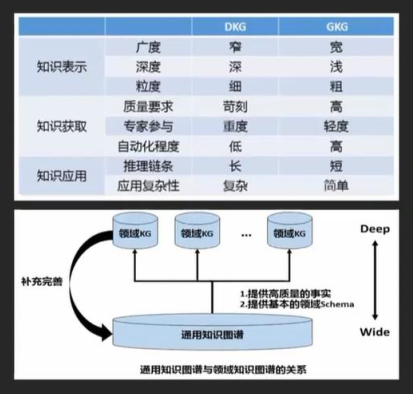

### 知识图谱的发展历程

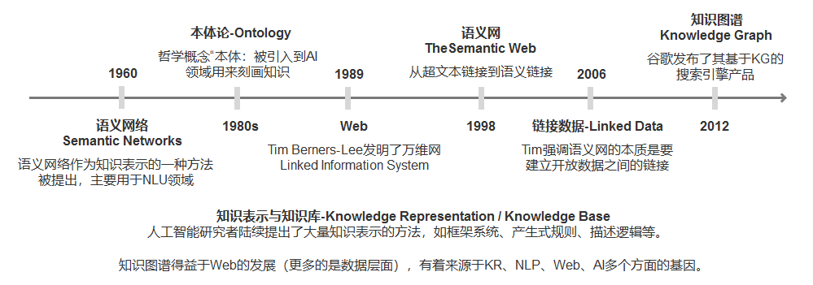

### 知识图谱的特点

那相比传统数据存储和计算方式，知识图谱的优势显现在哪里呢？

**（1）语义表达丰富，关系的表达能力强**

传统数据库通常通过表格、字段等方式进行读取，而关系的层级及表达方式多种多样，且基于图论和概率图模型，可以处理复杂多样的关联分析，满足企业各种角色关系的分析和管理需要。

**（2）描述形式（RDF）统一，便于不同类型知识的集成与融合**

**（3）表示方法对人类友好，便于以众包等方式编辑和构建知识**

**（4）表示方法对计算机友好，支持高效推理**

**（5）二元关系为基础的描述形式，便于知识的自动获取**

**（6）基于图结构的数据格式，便于计算机系统的存储与检索**

图式的数据存储方式，相比传统存储方式，数据调取速度更快，图库可计算超过百万潜在的实体的属性分布，可实现秒级返回结果，真正实现人机互动的实时响应，让用户可以做到即时决策。

### 知识图谱的作用

KG辅助搜索：网页搜索→语义搜索、Web of Docs→Web of Data。Freebase（社区协同构建）、WIKIDATA（维基众包）、schema.org（网页嵌入语义数据）

KG辅助问答：对话式的信息获取更需要精准度和可靠度。DBpedia、Yago、Wordnet、zhishi.me

KG辅助决策：代表性公司有Palantir(安全)、明略数据（安全）、Kensho（金融领域）

KA辅助推理：人是使用自己所有的知识和智能去理解。NLP+KG

### 知识图谱的重要性

知识图谱是实现认知智能的关键技术，是实现机器认知智能的使能器（Enabler）。

知识图谱可以有效提高NLU的效果，即NLP+KG=NLU。

大数据是知识图谱的知识来源，知识图谱反过来提高了大数据的利用率。

深度学习红利到顶，知识图谱还在半山腰。

知识图谱让可解释人工智能成为可能，可解释性是不能回避符号知识的。

知识图谱是个好东西，但不能站在“知识”的角度去用。

出路可能在于，基于用户在垂直场景内的目标和路径拆解，只显示他在做这个事的过程中所需要的知识信息。也就是说，根本上，不是知识加服务，而是包含了知识的服务价值。这是很多人还理解不到的。再往大了说，就是以后的知识经济（内容付费）产品形态，会和现在很不一样。

**注意事项：**

科学知识图谱更多是科研文献的知识图谱，并不是我们所说的知识图谱。

### 知识图谱的基本概念

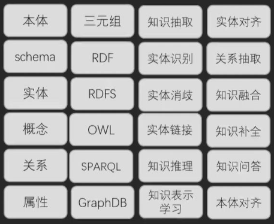

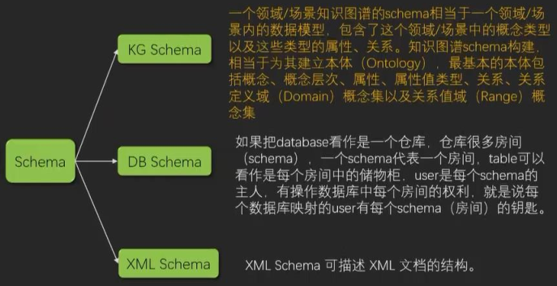

## 知识库的概念

#### 知识库的种类

知识库目前可以分为两种类型：**Curated KBs** 和 **Extracted KBs**。

**Curated KBs**：以yago2和freebase为代表，他们从维基百科和WordNet等知识库抽取了大量的实体及实体关系，可以把它理解城一种结构化的维基百科。

**\*Extracted KBs***：主要是以Open Information Extraction (Open IE),  Never-Ending Language Learning (NELL)为代表，他们直接从上亿个网页中抽取实体关系三元组。与freebase相比，这样得到的实体知识更具有多样性，而它们的实体关系和实体更多的则是自然语言的形式，如“姚明出生于上海。” 可以被表示为(“Yao Ming”, “was also born in”, “Shanghai”)。直接从网页中抽取出来的知识，也会存在一定的噪声，其精确度低于Curated KBs。

> 目前行业内使用的比较多的还是**Curated KBs***,*主要是因为**\*Curated KBs***比较简单，容易构建，噪音少。

#### 什么是知识库

a)“姚明出生于上海”

b)“姚明是篮球运动员”

c)“姚明是现任中国篮协主席”

以上就是一条条知识，把大量的知识汇聚起来就成为了知识库（Knowledge Base）。我们可以从wikipedia，百度百科等百科全书获取到大量的知识。但是，这些百科全书的知识是由非结构化的自然语言组建而成的，这样的组织方式很适合人们阅读但并不适合计算机处理。

图1：知识图实例

我们以搜索：“姚明的妻子是谁？”这句话为例，其对应结果三元组规则为{实体:姚明，关系:配偶，实体:叶莉}，

而当我们改以搜索：“叶莉今年多大?”进行检索，其对应结果三元组规则为{实体:叶莉，属性:age，属性值:34}，

> 知识图谱旨在描述真实世界中存在的各种实体或概念，因此知识整理进行入库时，对应的知识内容都会转为实体（eneity）概念，每个实体上都会标示一个唯一ID，并且每个对象属性值（attribute-value）用来刻画实体的内在特性，而关系(relation)用来连接两个实体，刻画它们之间的关联。
>
> 因此，将无数实体以对应关系的形式进行存储，知识图谱亦可被构建成一张巨大的网络图。
>
> 其中上述提到的实体、关系、属性，在存储之前都需要采用**RDF方式**对其进行结构化声明，即需要**事先定义一套标准的schema**在抽取数据之前做预备工作，由于是标准的schema，所以不管是抽取结构化数据或非结构化数据，内容都是适用的。

#### 知识库的表示形式

为了方便计算机的处理和理解，我们需要更加形式化、简洁化的方式去表示知识，那就是**`三元组（triple）`**。

“姚明出生于中国上海” 可以用三元组表示为(Yao Ming, PlaceOfBirth, Shanghai)[1]。这里我们可以简单的把三元组理解为**(实体entity,实体关系relation,实体entity)**。如果我们把实体看作是结点，把实体关系（包括属性，类别等等）看作是一条边，那么包含了大量三元组的知识库就成为了一个庞大的知识图。

有些时候会将实体称为**`topic`**，如Justin Bieber。**实体关系也可分为两种，一种是属性property，一种是关系relation**。如下图所示，属性和关系的最大区别在于，**属性所在的三元组对应的两个实体，常常是一个topic和一个字符串，如属性Type/Gender，对应的三元组（Justin Bieber, Type, Person），而关系所在的三元组所对应的两个实体，常常是两个topic。如关系PlaceOfBrith，对应的三元组（Justin Bieber, PlaceOfBrith, London）**。

图2：Justin Bieber知识图

（图中蓝色方块表示topic，橙色椭圆包括属性值，它们都属于知识库的实体；蓝色直线表示关系，橙色直线表示属性，它们都统称为知识库的实体关系，都可以用三元组刻画实体和实体关系）

#### 知识库的数据结构 

**freebase的基础知识表达形式：(实体)-[关系]-(实体)，(实体)-[关系]-(值)**即可，参考图3，姚明和叶莉的关系。

图3 知识表达

## 知识表示与建模

### 知识表示

知识表示（KR，Knowledge Representation）研究怎样用易于计算机处理的方式来描述人脑的知识，以及怎样通过符号之间的运算来模拟人脑的推理过程。

KR不是数据格式、不等同于数据结构、也不是编程语言，对于AI而言，数据与知识的区别在于LR支持推理。

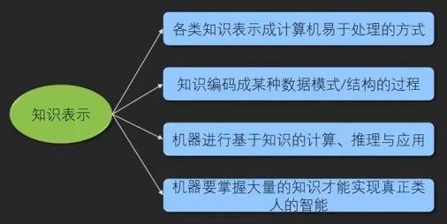

KR代表了Entity ID、概念模型、支持推理、易于计算、人可理解。

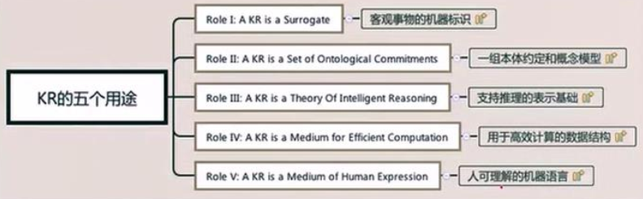

**基于离散符号的知识表示：（基于数理逻辑的知识表示）**

- RDF、OWL、各种Rule Language等
- 显示知识、强逻辑约束、易于解释、推理不易扩展

**基于连续符号的知识表示：（基于向量空间学习的分布式知识表示）**

- Tensor，各种Embedding，神经网络表示等
- 隐式知识、弱逻辑约束、不易解释、对接神经网络

**语义网知识表示框架：**

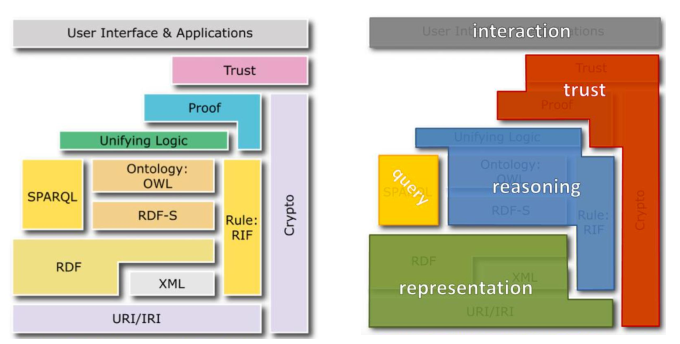

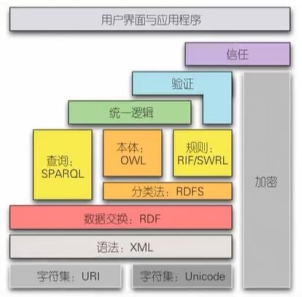

### 知识建模

知识建模主要是**模型/Schema设计**。

Schema定义知识图谱数据模型及用以描述物理世界的词汇体系，规范结构化数据的表达。

知识图谱通常以实体为节点形成一个大的网络，图谱的Schema相当于数据模型。

Schema设计基本目标是设计认知领域/业务场景的基本框架。需要**指定领域的基本概念，以及概念之间关系；明确领域的基本属性；明确属性的适用概念；明确属性值的类别或者范围**。此外，还要考虑**领域属性及属性值等相关的约束或规则**。

知识建模，即为知识和数据进行抽象建模，主要包括以下5个步骤：

1. 以节点为主体目标，实现对不同来源的数据进行映射与合并。（确定节点）
2. 利用属性来表示不同数据源中针对节点的描述，形成对节点的全方位描述。（确定节点属性、标签）
3. 利用关系来描述各类抽象建模成节点的数据之间的关联关系，从而支持关联分析。（图设计）
4. 通过节点链接技术，实现围绕节点的多种类型数据的关联存储。（节点链接）
5. 使用事件机制描述客观世界中动态发展，体现事件与节点间的关联，并利用时序描述事件的发展状况。（动态事件描述）

构建知识图谱：

构建KG的几个关键点：明确目标与任务、不重复造轮子、穷举知识要点、确定分类层级、定义属性与关系、确定各类约束、引导用户对感兴趣的事情广泛探索。

**明确目标与任务**

不同行业的知识体系区别非常大。在项目初期确定任务领域与其细分知识要点非常重要。整个产品生命周期内对于系统的可用应、易用性、扩展性需严格把控，避免越走越偏。

**不重复造轮子**

市面上已经有很多领域的开源KG项目，尽量基于已有项目进行扩展或优化。

项目伊始，先广泛调研已有相关KG项目，如各领域词典：医学CancerOntology、文化艺术与建筑AAT、地理TGN，各类开源知识图谱Freebase、OpenCyc、YAGO、DBpedia，以及维基百科、百度百科、互动百科、搜狗百科。 

**穷举知识要点**

在设计之初要想明白，哪些要素要展示在图谱中哪些不展示在图谱中，对知识体系中的概念进行清晰的定义和划分，尽量多的罗列对构建完整知识体系有帮助的要素，如人的属性：姓名、年龄、肤色、学历、职业、民族、国籍、籍贯、出生地、成长地、父亲、母亲、子女、祖父、祖母、母校等等，大致可分为自然属性和社会属性。穷举虽好，但也要考虑冗余性，尽量使图谱成为小而轻的存储载体，有利于高效的查询与检索。

**确定分类层级** 

收集足够的知识构建要素，接下来就要对这些要素进行严格的层级分类，有利于构建完整的知识体系，KG的构建一般分为两种方式自顶向下与自底向上。

**定义属性与关系**

为分类层级之后的实例确定属性值与各实例之间的关系。

目前大多数KG主要对实例、概念、属性、关系进行建模，少有对函数、约束、规则、公理等复杂的知识进行建模，也算KG深入发展的一个方向。

**定义各类约束**

不同的实例有不同的属性和关系，不同的属性和关系有不同的定义域和值域。如：“国家”不存在爱好与颜色的属性，“人物”不存在出版社的属性；“茶叶”与“咖啡”之间不存在亲子关系、朋友关系等。人的年龄不超过150岁，家禽的年龄一般有十几年。

定义值域保证其在合理范围内，尽量避免异常数据，提升产品可信度。

**引导用户对感兴趣的事情广泛探索**

Google知识图谱产品经理Emily Moxley将知识图谱的作用精炼地归纳为3点：

向用户明了的展示他们正在找的东西；

让用户在梗概中拥有深入探索的乐趣；

用户能够围绕一个话题进行广泛的探索；

**人工构建方法**

**自动构建方法**

**典型知识体系**

**知识建模工具**

斯坦福本体构建工具：[Protege](http://protege.stanford.edu/)

## 知识抽取

抽取知识之前首先是数据的获取，数据可以从下述途径获取：通用/领域知识库、垂直聚合网站、百科类站点、网媒类数据。

从不同来源、不同结构的数据中进行提取出实体（概念）、属性以及实体间的相互关系，在此基础上形成本体化的知识表达，形成知识存入到知识图谱，这一过程称为**知识抽取**。

针对不同种类的数据，我们会利用不同的技术进行抽取。

结构化数据：

- 链接数据：图映射
  - 难点：**数据对齐**。

- 数据库：D2R转换
  - 难点：**复杂表数据的处理**。

半结构化数据：

- 包装器
  - 难点：**方便的包装器定义方法，包装器自动生成、更新与维护**。

文本数据：难点：**结果的准确率与覆盖率**。

- 术语抽取

- 实体抽取

- 关系抽取

- 属性抽取

- 事件抽取

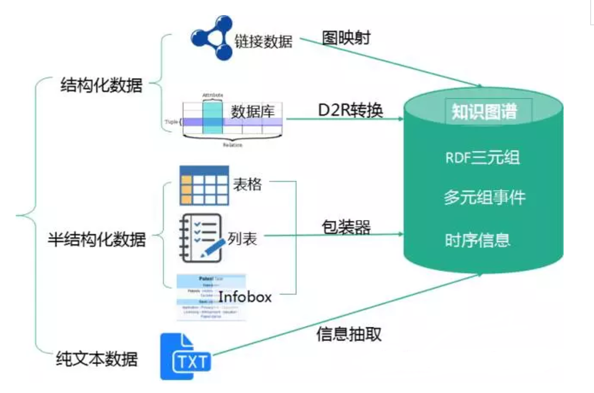

### 结构化数据

### 半结构化数据

### 非结构化数据

#### 实体识别与抽取

指的是从原始语料中自动识别出命名实体，由于实体是知识图谱中的最基本元素，其抽取的完整性、准确率、召回率等将直接影响到知识库的质量。因此，实体抽取是知识抽取中最为基础与关键的一步。

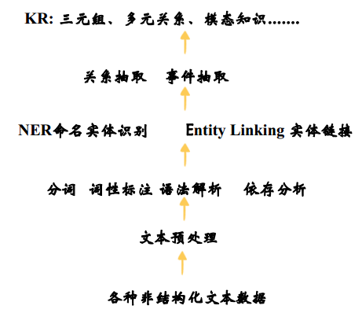

#### 实体消歧

**实体统一**

有些实体写法上不一样，但其实是指向同一个实体。比如“NYC”和“New York”表面上是不同的字符串，但其实指的都是纽约这个城市，需要合并。

实体统一不仅可以减少实体的种类，也可以降低图谱的稀疏性（Sparsity）。

**指代消解**

指代消解，比如文本中出现的“it”, “he”, “she”这些词到底指向哪个实体。

#### 属性抽取

#### 关系抽取

#### 事件抽取

### 知识抽取工具

浙江大学支持中文的DeepDive

## 知识存储与融合

构建知识图谱的目标：从多源数据中抽取出Schema中定义的实体与关系数据，进而形成一个多元知识节点互联的知识库，进而支撑知识检索、知识推荐、知识问答、知识分析等知识服务。

基本组成元素就是**知识元/节点（实体）、属性与其关系元**。

知识服务的基础就是需要对知识图谱基本元素的检索。

知识图谱的存储就是设计一个合理的存储方案实现对知识（知识元与关系）的持久化存储并提供高效的检索。

### 知识存储

**知识图谱主要有两种存储方式：基于RDF的存储；基于图数据库的存储。**在实践中，多为混合存储结构，图存储并非必须。

它们之间的区别如下图所示。

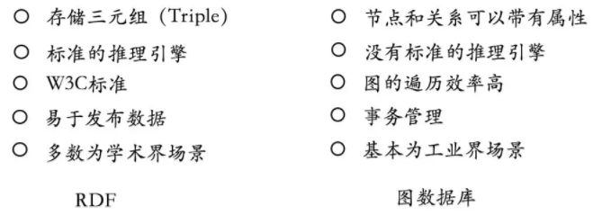

RDF一个重要的设计原则是数据的易发布以及共享，图数据库则把重点放在了高效的图查询和搜索上。

RDF以三元组的方式来存储数据而且不包含属性信息，但图数据库一般以属性图为基本的表示形式，所以实体和关系可以包含属性，这就意味着更容易表达现实的业务场景。

图谱的数据存储既需要完成基本的数据存储，同时也要能支持上层的知识推理、知识快速查询、图实时计算等应用，因此需要存储以下信息：三元组（由开始节点、关系、结束节点三个元素组成）知识的存储、事件信息的存储、时态信息的存储、使用知识图谱组织的数据的存储。

其关键技术和难点就在于：

1. 大规模三元组数据的存储；
2. 知识图谱组织的大数据的存储；
3. 事件与时态信息的存储；
4. 快速推理与图计算的支持。

**图数据库：**

知识图谱的图存储在图数据库（Graph Database）中，图数据库以图论为理论基础，图论中图的基本元素是节点和边，在图数据库中对应的就是节点和关系。用节点和关系所组成的图，为真实世界直观地建模，支持百亿量级甚至千亿量级规模的巨型图的高效关系运算和复杂关系分析。

目前市面上较为流行的图数据库有：Neo4j、Orient DB、Titan、Flock DB、Allegro Graph等。不同于关系型数据库，一修改便容易“牵一发而动全身”。图数据库可实现数据间的“互联互通”，与传统的关系型数据库相比，图数据库更擅长建立复杂的关系网络。

图数据库将原本没有联系的数据连通，将离散的数据整合在一起，从而提供更有价值的决策支持。

Neo4j系统目前仍是使用率最高的图数据库，它拥有活跃的社区，而且系统本身的查询效率高，但唯一的不足就是**不支持准分布式**。通常来讲，对于10亿节点以下规模的图谱来说Neo4j已经足够了。

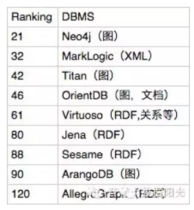

**知识存储工具：**

北京大学GStore

### 知识查询

SPARQL是RDF的查询语言，基于RDF数据模型，由所有主流图数据库支持。可以对不同的数据集撰写复杂的连接（joins）。

http://www.w3.org/TR/rdf-sqarql-query/

### 知识融合

知识融合，在获得新知识后，需要对其进行整合，以消除矛盾和歧义，比如某些实体可能有多种表达，某个特定称谓也许对应于多个不同的实体等。

 知识融合分为实体之间的融合和知识库之间的融合。

- 实体之间的融合：
  - 实体消歧
  - 实体链接
    - 从文本中通过实体抽取得到实体指称项
    - 进行实体消歧和共指消解
    - 在确认知识库中对应正确实体对象之后，将该实体指称链接到知识库中对应实体

- 知识库之间融合：
  - 实体对齐：识别不同来源的同一实体
  - 属性融合：识别同一属性的不同描述
  - 值规范化：不同来源的数据值通常有不同的格式、不同的单位或者不同的描述形式。比如日期有数十种表达方式，这些需要规范化到统一格式。

知识融合分为合并外部知识库、合并关系数据库2种。

合并外部知识库主要分为数据模式层融合和数据层融合，分别用的技术如下：

- 数据模式层融合：
  - 将所得到的本体融入已有的本体库中。
  - 概念合并、概念上下位关系合并、概念的属性定义合并。

- 数据层融合：
  - 包括实体的指称、属性、关系以及所属类引导。
  - 节点合并、节点属性融合、冲突检测与解决
  - 如某一节点的数据来源有：豆瓣短文、数据库、网页爬虫等，需要将不同数据来源的同一节点进行数据层的融合。

由于行业知识图谱的数据模式通常采用自顶向下（由专家创建）和自底向上（从现有的行业标准转化，从现有高质量数据源（如百科）转化）结合的方式，在模式层基本都经过人工的校验，保证了可靠性，因此，知识融合的关键任务在数据层的融合。

**框架匹配**

**实体对齐**

实体对齐也称为实体匹配或实体解析，主要是用于消除异构数据中实体冲突、指向不明等不一致性问题，可以从顶层创建一个大规模的统一知识库，从而帮助机器理解多源异质的数据，形成高质量的知识。

**冲突检测与消解**

**知识融合工具**

Limes-实体链接发现框架

Dedupe（基于Python的工具包）

## 知识计算与推理

**知识加工**：对于经过融合的新知识，需要经过质量评估之后（部分需要人工参与甄别），才能将合格的部分加入到知识库中，以确保知识库的质量，新增数据之后，可以进行知识推理、拓展现有知识、得到新知识。

- 本体构建
  - 实体并列关系相似度计算
    - 模式匹配法
    - 分布相似度
  - 实体上下位关系抽取
  - 本体的生成
- 知识推理
  - 基于逻辑的推理
    - 一阶逻辑谓词
    - 描述逻辑
    - 基于规则的推理
  - 基于图的推理
- 质量评估

知识图谱最核心的功能是推理。推理并不是发现新知识，而是对图谱中隐藏关系的发现。推理的实现是因为知识图谱运用了集合论的理论。全集、子集、继承。

知识推理是指从知识库中已有的实体关系数据出发，进行计算机推理，建立实体间的新关联，从而拓展和丰富知识网络。知识推理是知识图谱构建的重要手段和关键环节，通过知识推理，能够从现有知识中发现新的知识。主要用于知识补全、关系预测、知识问答等。

在推理的过程中，往往需要关联规则的支持。由于实体、实体属性以及关系的多样性，很难穷举所有的推理规则，一些较为复杂的推理规则往往是手动总结的。

对于推理规则的挖掘，主要还是依赖于实体以及关系间的丰富同现情况。知识推理的对象可以是实体、实体的属性、实体间的关系、本体库中概念的层次结构等。

知识推理分为：基于符号演算的推理、基于数值计算的推理。

**知识推理方法主要可分为基于逻辑的推理与基于图的推理两种类别**。

按解决方法分类：

- 基于描述逻辑的推理：本体推理
- 基于规则挖掘的推理
- 基于概率逻辑的推理
- 基于表示学习与神经网络的推理

按推理类型分类：

- 缺省推理（Default reasoning）
- 连续变化推理（Continuous Change reasoning）
- 空间推理（Spatial reasoning）
- 因果关系推理（Causality reasoning）

**（4）知识更新**

根据知识图谱的逻辑结构，其**更新主要包括模式层的更新与数据层的更新**。模式层的更新是指本体中元素的更新，包括概念的增加、修改、删除，概念属性的更新以及概念之间上下位关系的更新等。

其中，概念属性的更新操作将直接影响到所有直接或间接属性的子概念和实体。通常来说，模式层的增量更新方式消耗资源较少，但是多数情况下是在人工干预的情况下完成的，例如：需要人工定义规则，人工处理冲突等。因此，实施起来并不容易。

**（8）知识计算**

知识计算主要是在知识图谱中知识和数据的基础上，通过各种算法，发现其中显式的或隐含的知识、模式或规则等，知识计算的范畴非常大，这里主要讲三个方面：

1. **图挖掘计算：**基于图论的相关算法，实现对图谱的探索和挖掘。
2. **本体推理：**使用本体推理进行新知识发现或冲突检测。
3. **基于规则的推理：**使用规则引擎，编写相应的业务规则，通过推理辅助业务决策。

**（9）图挖掘和图计算**

知识图谱之上的图挖掘和计算主要分以下6类：

- 第一是图遍历，知识图谱构建完之后可以理解为是一张很大的图，怎么去查询遍历这个图，要根据图的特点和应用的场景进行遍历；
- 第二是图里面经典的算法，如最短路径；
- 第三是路径的探寻，即给定两个实体或多个实体去发现他们之间的关系；
- 第四是权威节点的分析，这在社交网络分析中用的比较多；
- 第五是族群分析；
- 第六是相似节点的发现。

**（10）可视化技术**

目前两个比较常见的可视化工具是：**D3.js和ECharts。**

- **D3.js：**全称Data-Driven Documents，是一个用动态图形显示数据的JavaScript库，一个数据可视化工具，它提供了各种简单易用的函数，大大方便了数据可视化的工作。
- **ECharts：**是一款由百度前端技术部开发的，同样基于Javascript的数据可视化图标库。它提供大量常用的数据可视化图表，底层基于ZRender（一个全新的轻量级canvas类库），创建了坐标系、图例、提示、工具箱等基础组件，并在此上构建出折线图（区域图）、柱状图（条状图）、散点图（气泡图）、饼图（环形图）、K线图、地图、力导向布局图以及和弦图，同时支持任意维度的堆积和多图表混合展现。

**（11）异常分析**

大多数基于图的异常分析的计算量比较大，可以选择做`离线计算`。异常分析分为两大类： 静态分析和动态分析。

- 静态分析指的是，给定一个图形结构和某个时间点，从中去发现一些异常点。

- 动态分析指的是分析其结构随时间变化的趋势。涉及到时序分析技术和图相似性计算技术。

## 知识图谱的应用场景

图4 知识图谱的应用

知识图谱**将传统基于关键字的搜索模型转向基于语义的搜索升级。**

目前知识图谱产品的客户行业，分类主要集中在：社交网络、人力资源与招聘、金融、保险、零售、广告、物流、通信、IT、制造业、传媒、医疗、电子商务和物流等领域。在风控领域中，知识图谱类产品主要应用于反欺诈、反洗钱、互联网授信、保险欺诈、银行欺诈、电商欺诈、项目审计作假、企业关系分析、罪犯追踪等场景中。

在语义搜索这一块，知识图谱的搜索不同于常规的搜索，常规的搜索是根据keyword找到对应的网页集合，然后通过page rank等算法去给网页集合内的网页进行排名，然后展示给用户；基于知识图谱的搜索是在已有的图谱知识库中遍历知识，然后将查询到的知识返回给用户，通常如果路径正确，查询出来的知识只有1个或几个，相当精准。

问答系统这一块，系统同样会首先在知识图谱的帮助下对用户使用自然语言提出的问题进行语义分析和语法分析，进而将其转化成结构化形式的查询语句，然后在知识图谱中查询答案。

### 语义搜索

Google、百度都已有相关应用。

搜索+知识图谱是未来搜索引擎的发展方向。

用户搜索关键词可能有多重意思，知识图谱可以展示最全面的信息，更有机会命中用户需求，真正做到相关信息更准确、相关。

从文本分析为核心转变成立知识发现为核心。

### 推荐

基于知识图谱的推荐可以：

- 提高精确度（precision）
  - 知识图谱为物品引入了更多的语义关系
  - 知识图谱可以深层次地发现用户兴趣
- 增加多样性（diversity）
  - 知识图谱提供了不同的关系连接种类
  - 有利于推荐结果的发散，避免推荐结果越来越局限于单一类型
- 可解释性（interpretability）
  - 知识图谱可以连接用户的兴趣历史和推荐结果
  - 提高用户对推荐结果的满意度和接受度，增强用户对推荐系统的信任

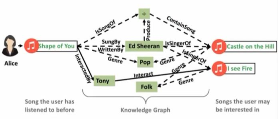

### 知识问答

KBQA（Knowledge-Based Question Answering，基于知识库的问题回答）

以直接而准确的方式回答用户自然语言提问的自动问答系统将构成下一代搜索引擎的基本形态。

知识问答工具：YodaQA-开源QA工具

### 知识决策

### 知识解释

## 知识图谱的应用领域

**金融知识图谱：**

公司有：平安金融、天眼查、企查查

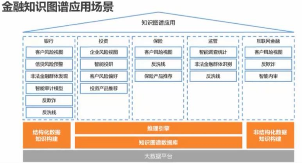

**医学知识图谱：**

公司有：平安医疗科技

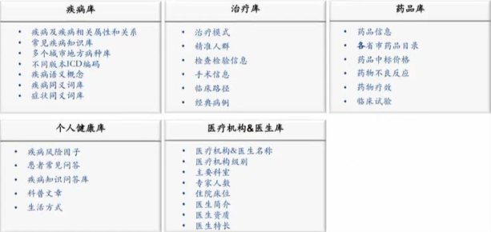

**电商/生活知识图谱：**

公司有：阿里巴巴、美团

## 知识图谱的构建

知识图谱的构建方式有：专家人工（WordNet）、大众协作/众包（Freebase）、百科抽取/知识库融合（DBpedia、Yago）、自由网页抓取（NELL）。

知识图谱的构建流程：

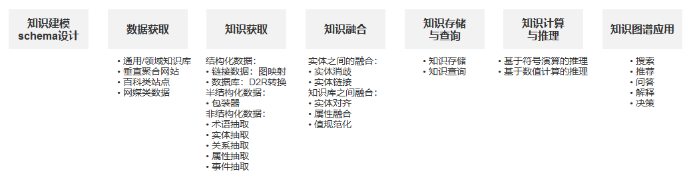

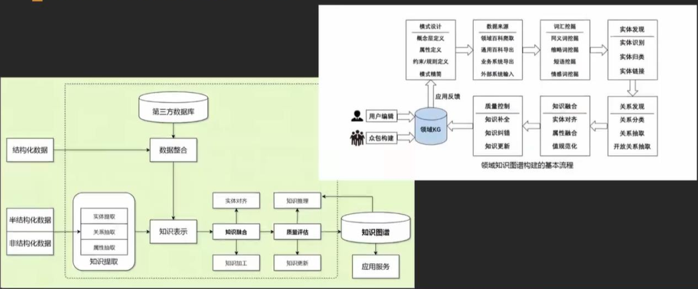

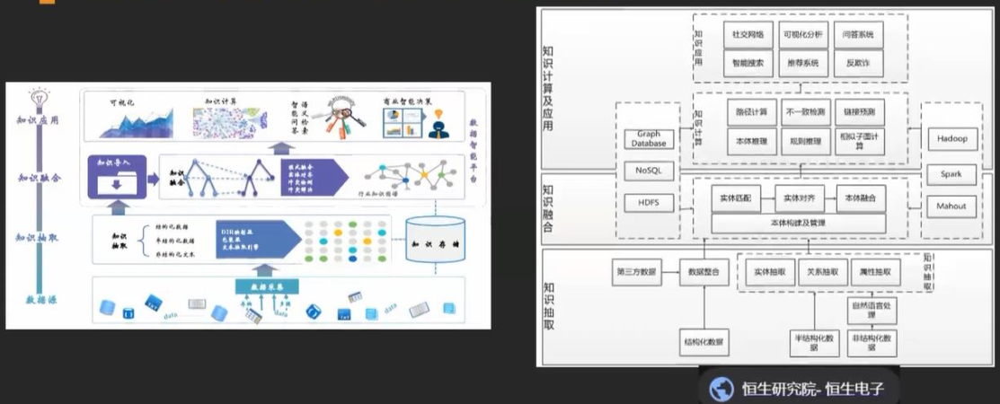

## 知识图谱的现状与未来

### 知识图谱的现状

现有的大规模知识图谱都大量的依赖开放域的数据抽取和开放社区的方式构建。

所有KG的共同问题——知识缺失严重。

**注意事项：**

不能指望NLP和机器学习能自动的去构建你真正需要的知识图谱。但KG的确需要大量的使用NLP/ML的各种技术手段，来帮助冷启动、后期补全和质量提升。

NLP只是获取KG的手段之一，文本也只是KG数据的来源之一。

构建KG的成本非常高，单一机构无法构建覆盖全面的知识图谱，应该需求开放社区和外部数据的帮助。

不要因为KG而KG，要结合场景、数据、技术来决定是否采用KG、采用什么样的KG。

以应用需求为导向，从常见简单应用场景进行尝试，从“小场景”入手，对本领域业务目标有一定的认知，定义好场景与问题边界。

知识密集数据中存在多种“知识节点"，“知识节点"之间存在关联或者能够建立关系，系统梳理场景背后的数据及关系。同时，避免从零开始，善用已有数据/知识库/本体/术语词典等。

对KG整个知识体系与相关基础内容有个全面客观的认知，根据对业务场景的理解，对数据的梳理，灵活配置自己的流程与方法，奥卡姆剃刀原则。

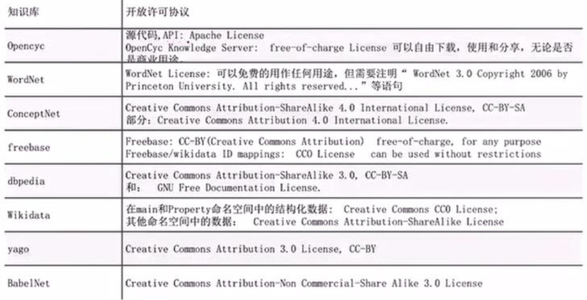

### 知识图谱的未来

事理图谱：

事理图谱是一个有向有环图。节点代表抽象时间，有向边代表事件之间的顺承、因果等事理逻辑关系。本质上，事理图谱是一个事理逻辑知识库，描述了抽象事件之间的演化规律和模式。

事理图谱刻画对象是事件及事件间的关系，传统知识图谱刻画对象是实体、概念及相关关系。

事件中包含任务、机构、地点等实体，实体知识库之间产生互动，形成包括实体、关系、属性、事件、事件属性、事件参与角色（论元）和事件之间的特殊关联关系等在内的全新数据结构和知识表示框架。

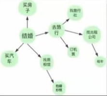

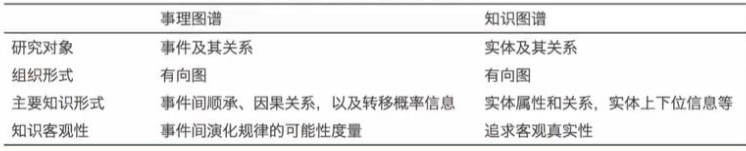

### 开放KG

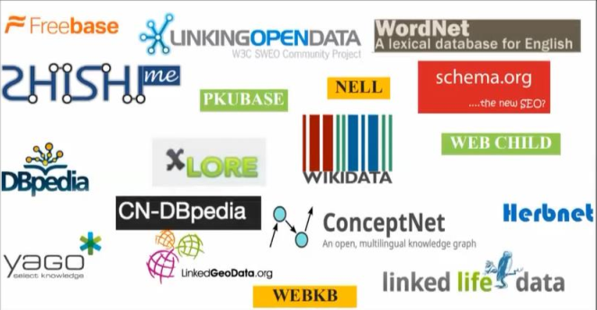

清华大学开放百科KG：XLORE

东南大学、狗尾草额吉：zhishi.me百科KG

复旦大学开放百科KG：CN_DBPedia

北京大学百科KG：PKUBase

清华大学：科技知识图谱

微软亚研：ConceptGraph

文因互联：公众公司人物图谱

上海图书馆：名人手稿档案关联开放数据集

赫连阿姆斯特丹自有大学：医学知识图谱

华东理工大学：中文症状库

广州索达：菜谱知识图谱

cnSchema是中文知识图谱的“普通话”标准。cnSchema面向中文信息处理。主要贡献者有：王昊奋、肖仰华、鲍捷、曾毅、邹磊、王宇等。