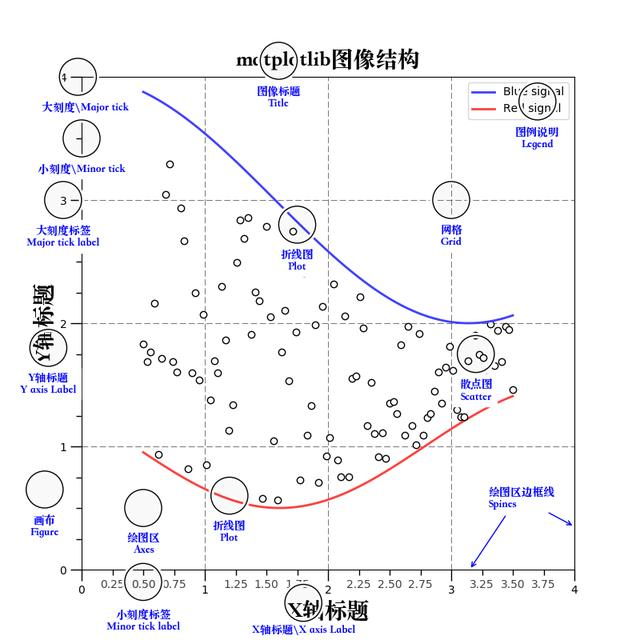
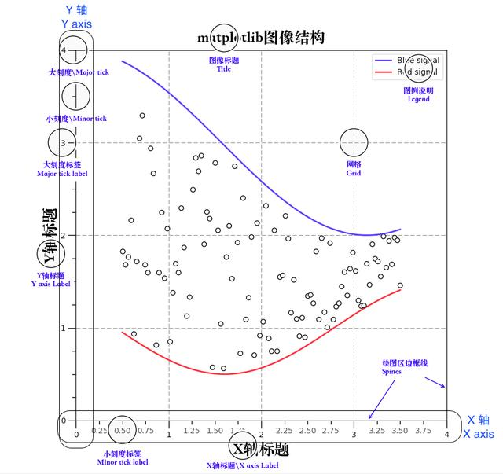
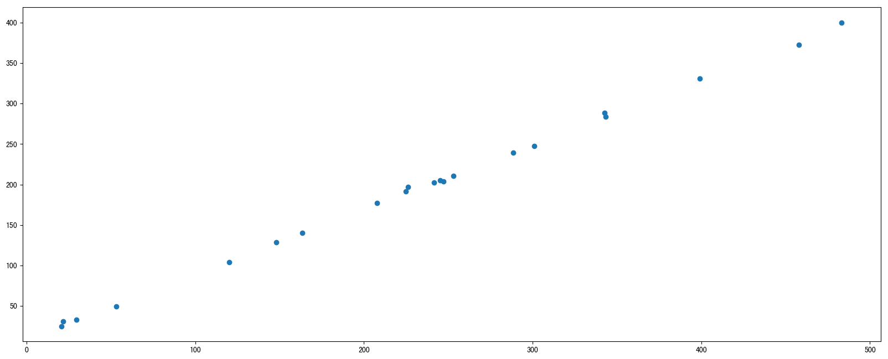
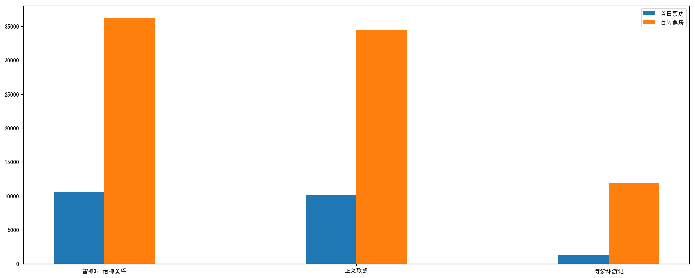
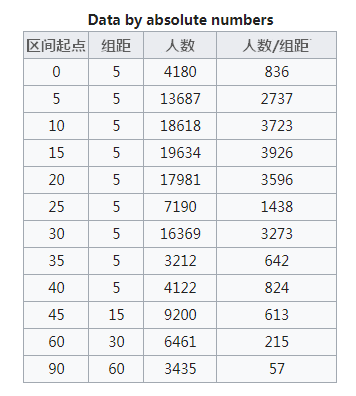
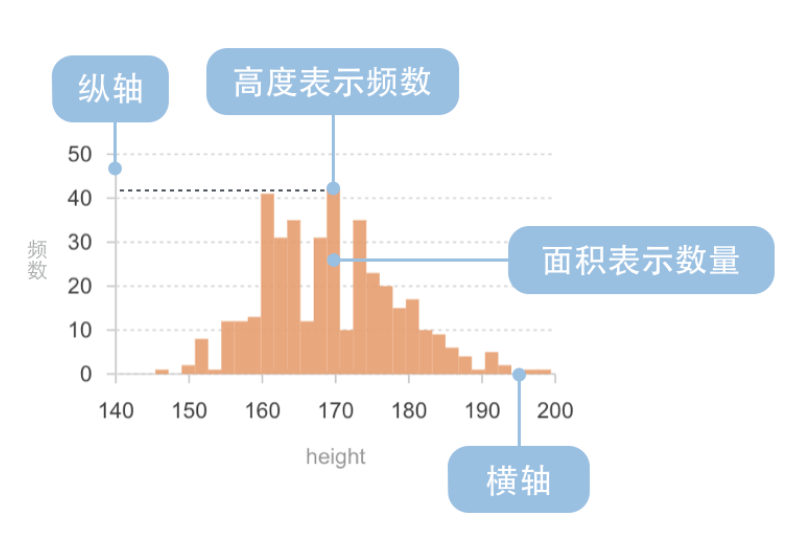
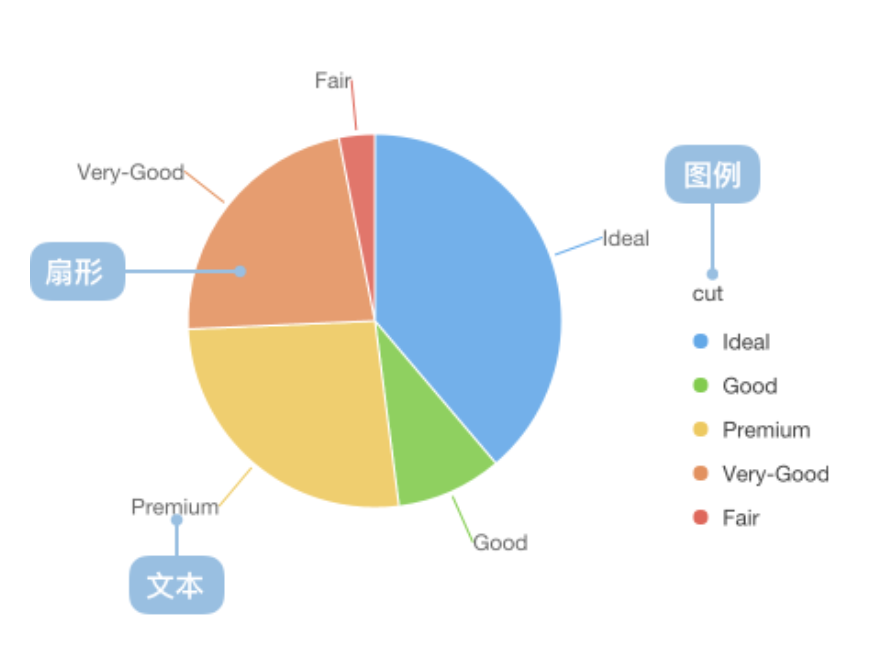
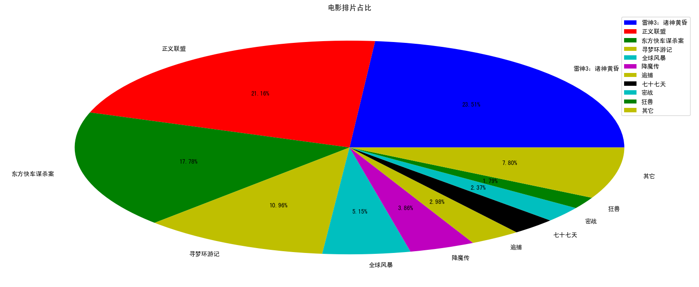
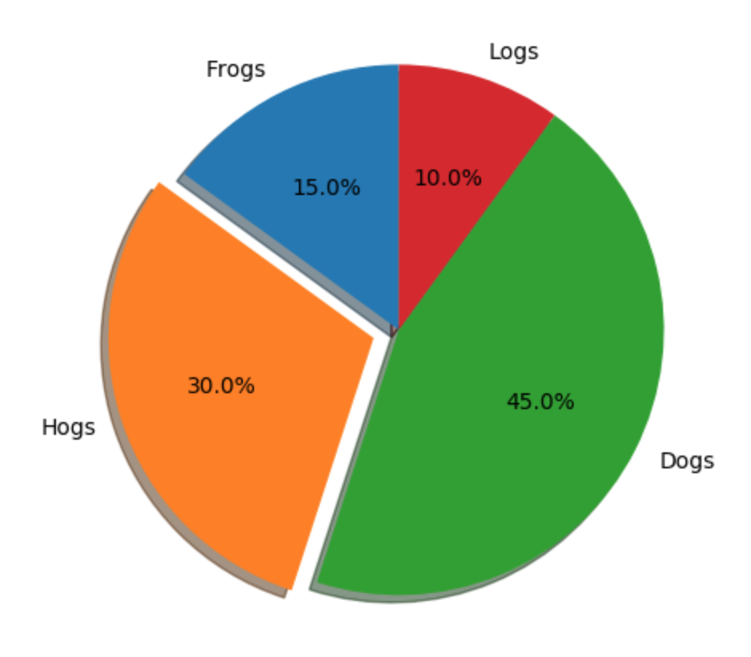

# Matplotlib

**目标：**

>知道Matplotlib的架构
>掌握常见统计图的绘制及其意义
>应用Matplotlib的基本功能实现图形显示
>应用Matplotlib实现多图显示
>应用Matplotlib实现不同画图种类
>知道annotate或者text添加图的注释
>知道animation实现动画的创建

## 0、速查
[Matplotlib中文文档](https://www.matplotlib.org.cn/)
[Matplotlib官方文档](https://matplotlib.org/index.html)


## 1、Matplotlib图像的3层结构



### 1.1 容器层

容器层主要由**Canvas、Figure、Axes**组成。

**Canvas**是位于最底层的系统层，在绘图的过程中充当画板的角色，即放置画布(Figure)的工具。

**Figure**是Canvas上方的第一层，也是需要用户来操作的应用层的第一层，在绘图的过程中充当画布的角色。

**Axes**是应用层的第二层，在绘图的过程中相当于画布上的绘图区的角色。

- Figure:指整个图形(可以通过plt.figure()设置画布的大小和分辨率等)
- Axes(**坐标系**):数据的绘图区域
- Axis(**坐标轴**)：坐标系中的一条轴，包含大小限制、刻度和刻度标签

特点为：

- 一个figure(画布)可以包含多个axes(坐标系/绘图区)，但是一个axes只能属于一个figure。

- 一个axes(坐标系/绘图区)可以包含多个axis(坐标轴)，包含两个即为2d坐标系，3个即为3d坐标系 

  

### 1.2 辅助显示层

辅助显示层为Axes(绘图区)内的除了根据数据绘制出的图像以外的内容，主要包括**Axes外观(facecolor)、边框线(spines)、坐标轴(axis)、坐标轴名称(axis label)、坐标轴刻度(tick)、坐标轴刻度标签(tick label)、网格线(grid)、图例(legend)、标题(title)**等内容。



### 1.3 图像层

图像层指Axes内通过**plot、scatter、bar、histogram、pie**等函数根据数据绘制出的图像。


- 总结：
  - Canvas（画板）位于最底层，用户一般接触不到
  - Figure（画布）建立在Canvas之上
  - Axes（绘图区）建立在Figure之上
  - 坐标轴（axis）、图例（legend）等辅助显示层以及图像层都是建立在Axes之上


## 2、常见图形种类及意义

- 折线图：以折线的上升或下降来表示统计数量的增减变化的统计图

  **特点：能够显示数据的变化趋势，反映事物的变化情况。(变化)**

  

- 散点图：用两组数据构成多个坐标点，考察坐标点的分布,判断两变量之间是否存在某种关联或总结坐标点的分布模式。

  **特点：判断变量之间是否存在数量关联趋势,展示离群点(分布规律)**

  

- 柱状图：排列在工作表的列或行中的数据可以绘制到柱状图中。

  **特点：绘制连离散的数据,能够一眼看出各个数据的大小,比较数据之间的差别。(统计/对比)**

  

- 直方图：由一系列高度不等的纵向条纹或线段表示数据分布的情况。 一般用横轴表示数据范围，纵轴表示分布情况。

  **特点：绘制连续性的数据展示一组或者多组数据的分布状况(统计)**

  

- 饼图：用于表示不同分类的占比情况，通过弧度大小来对比各种分类。

  **特点：分类数据的占比情况(占比)**

  


## 3、折线图(plot)

**学习目标：**
- 知道如何解决中文显示问题
- 应用figure实现创建绘图区域大小
- 应用plot实现折线图的绘制
- 应用title,xlabel,ylabel实现标题以及x,y轴名设置
- 应用xticks,yticks实现axes的刻度设置和标注
- 应用savefig实现图形的本地保存
- 应用grid实现显示网格应用axis实现图像形状修改
- 应用legend实现图形标注信息显示
- 应用plt.subplots实现多坐标系的创建
- 知道如何设置多个axes的标题、刻度
- 知道折线图的应用场景

### 3.1 ★pytplot语法★

matplotlib.pytplot包含了一系列类似于matlab的画图函数。

```python
import matplotlib.pyplot as plt
```

**语法：**

- 创建画布，并设置画布属性
    - **plt.figure**(figsize=(,), dpi=)
        - 返回fig对象
        - figsize:指定图的长宽
        - dpi:图像的清晰度
- 显示图例
  - **plt.legend**(loc="best")
  - 只在plt.plot()中设置label还不能最终显示出图例，还需要通过plt.legend()将图例显示出来。
  

- 自定义x, y坐标刻度
    - 构造x, y刻度
        - x_ticks_label = ["11点{}分".format(i) for i in x]
        - y_ticks = range(40)
    - 设置x, y轴坐标的刻度显示
        - **plt.xticks**(x, \*\*kwargs) # x:要显示的刻度值
        - **plt.yticks**(y, \*\*kwargs) # y:要显示的刻度值

- 添加x轴、y轴描述信息及图标题
    - **plt.xlabel**("时间")
    - **plt.ylabel**("温度")
    - **plt.title**("中午11点0分到12点之间的温度变化图示")

- 添加网格显示
  - **plt.grid**(True, linestyle='--', alpha=0.5)
    - True：
    - linestyle：网格线条类型
    - alpha：粗细


- 保存图片到指定路径

  - **plt.savefig**(path)
- 显示图像
    - **plt.show**()
    - plt.show()会释放figure资源，如果在显示图像之后保存图片将只能保存空图片
- 创建多个画布

    - **plt.subplots**(nrows=1, ncols=2, figsize=(20, 8), dpi=80)

- 绘制图形
  - 折线图
    - **plt.plot**(x, y, color="r", linestyle='--', label="")
    - 多次用plot可以在同一个坐标系中画多个折线
  - 散点图
      - **plt.scatter**()
  - 柱状图
      - **plt.bar**()
  - 直方图
      - **plt.hist**()
  - 饼图
      - **plt.pie**()
  - 通用属性：
      - x, y：数据，如：plt.plot([1, 0, 9], [4, 5, 6])
      - color：颜色
      - linestyle：线条类型
      - label：图例


**设置图形风格**

| 颜色字符color | 风格字符linestyle |
| -------- | -------------- |
| r 红色   | - 实线         |
| g 绿色   | - - 虚线       |
| b 蓝色   | -. 点划线      |
| w 白色   | : 点虚线       |
| c 青色   | ' ' 留空、空格 |
| m 洋红   |                |
| y 黄色   |                |
| k 黑色   |                |


### 3.2 单个坐标系的折线图绘制

**展现上海、北京一周的天气,比如从星期一到星期日的天气温度

代码如下：

```python
# 画出温度变化图
import random
import matplotlib.pyplot as plt
%matplotlib inline # 使其能够在jupyter中显示图像

# 准备x, y坐标的数据
x = range(60)
# 上海、北京的温度数据
y_shanghai = [random.uniform(15, 18) for i in x]
y_beijing = [random.uniform(1, 3) for i in x]

# 1）创建画布
plt.figure(figsize=(20, 8), dpi=80)

# 2）绘制折线图
plt.plot(x, y_shanghai, label="上海")
# 使用多次plot可以画多个折线
plt.plot(x, y_beijing, color='r', linestyle='--', label="北京")

# 显示图例
plt.legend(loc="best")

# 自定义x, y刻度
# 构造x轴刻度标签
x_ticks_label = ["11点{}分".format(i) for i in x]
# 构造y轴刻度
y_ticks = range(40)

# 修改x,y轴坐标的刻度显示
plt.xticks(x[::5], x_ticks_label[::5])
plt.yticks(y_ticks[::5])

# 添加网格显示
plt.grid(True, linestyle='--', alpha=0.5)

# 添加x轴、y轴描述信息及标题
plt.xlabel("时间")
plt.ylabel("温度")
plt.title("中午11点0分到12点之间的温度变化图示")

# ）保存图片到指定路径
plt.savefig("test.png")

# 3）显示图像
plt.show()
```

### 3.3 多个坐标系的折线图绘制

如果我们想要将上海和北京的天气图显示在同一个图的不同坐标系当中，效果如下：


可以通过subplots函数实现(旧的版本中有subplot，使用起来不方便)，推荐subplots函数

- matplotlib.pyplot.subplots(nrows=1, ncols=1, \*\*fig_kw) 创建一个带有多个axes(坐标系/绘图区)的图

  ```
  Parameters:    
  
  nrows, ncols : int, optional, default: 1, Number of rows/columns of the subplot grid.
  **fig_kw : All additional keyword arguments are passed to the figure() call.
  
  Returns:    
  fig : 图对象
  ax : 
      设置标题等方法不同：
      set_xticks
      set_yticks
      set_xlabel
      set_ylabel
  ```

  关于axes子坐标系的更多方法：参考<https://matplotlib.org/api/axes_api.html#matplotlib.axes.Axes>

- 注意：**plt.函数名()**相当于面向过程的画图方法，**axes.set_方法名()**相当于面向对象的画图方法。


代码如下：

```python
# 画出温度变化图
import random

# 准备x, y坐标的数据
x = range(60)
y_shanghai = [random.uniform(15, 18) for i in x]
# 增加北京的温度数据
y_beijing = [random.uniform(1, 3) for i in x]

# 1）创建画布
# plt.figure(figsize=(20, 8), dpi=80)
fig, axes = plt.subplots(nrows=1, ncols=2, figsize=(20, 8), dpi=80)

# 2）绘制折线图
# plt.plot(x, y_shanghai)
# plt.plot(x, y_shanghai, label="上海")
axes[0].plot(x, y_shanghai, label="上海")
# 使用多次plot可以画多个折线
# plt.plot(x, y_beijing, color='r', linestyle='--', label="北京")
axes[1].plot(x, y_beijing, color='r', linestyle='--', label="北京")

# 显示图例
# plt.legend(loc="best")
axes[0].legend()
axes[1].legend()

# 增加以下两行代码
# 构造x轴刻度标签
x_ticks_label = ["11点{}分".format(i) for i in x]
# 构造y轴刻度
y_ticks = range(40)

# 修改x,y轴坐标的刻度显示
# plt.xticks(x[::5], x_ticks_label[::5])
# plt.yticks(y_ticks[::5])
axes[0].set_xticks(x[::5], x_ticks_label[::5])
axes[0].set_yticks(y_ticks[::5])
axes[1].set_xticks(x[::5], x_ticks_label[::5])
axes[1].set_yticks(y_ticks[::5])

# 添加网格显示
# plt.grid(True, linestyle='--', alpha=0.5)
axes[0].grid(True, linestyle='--', alpha=0.5)
axes[1].grid(True, linestyle='--', alpha=0.5)

# 添加x轴、y轴描述信息及标题
# plt.xlabel("时间")
# plt.ylabel("温度")
# plt.title("中午11点0分到12点之间的温度变化图示")
axes[0].set_xlabel("时间")
axes[0].set_ylabel("温度")
axes[0].set_title("上海中午11点0分到12点之间的温度变化图示")
axes[1].set_xlabel("时间")
axes[1].set_ylabel("温度")
axes[1].set_title("北京中午11点0分到12点之间的温度变化图示")

# 3）显示图像
plt.show()
```

### 3.4 各种数学函数图像的绘制

  - plt.plot()除了可以画折线图，也可以用于画各种数学函数图像

    

代码：

```python
import numpy as np
# 1）准备数据
x = np.linspace(-10, 10, 1000)
y = np.sin(x)

# 2）创建画布
plt.figure(figsize=(20, 8), dpi=100)

# 3）绘制函数图像
plt.plot(x, y)
# 添加网格显示
plt.grid()

# 4）显示图像
plt.show()
```


### 3.5 中文显示问题

如果没有解决过中文问题的话，会显示这个样子：


#### 中文显示问题解决办法

下载中文字体（黑体，看准系统版本）

- 下载 [SimHei](images/SimHei.ttf) 字体（或者其他的支持中文显示的字体也行）

#### 1） 安装字体

- windows和mac下：双击安装

- linux下：拷贝字体到 usr/share/fonts 下：

  ```python
  sudo cp ~/SimHei.ttf /usr/share/fonts/SimHei.ttf
  ```
```

  注）Linux如果用ubantu也可以通过双击安装

#### 2） 删除matplotlib缓存文件

**Mac系统的解决方案：**

- 删除~/.matplotlib中的缓存文件

​```python
cd ~/.matplotlib
rm -r *
```

**Linux系统的解决方案**

- 删除~/.cache/matplotlib中的缓存文件

```python
cd ~/.cache/matplotlib
rm -r *
```

#### 3） 修改配置文件matplotlibrc

**Mac系统的解决方案：**

- 修改配置文件matplotlibrc

```python
vi ~/.matplotlib/matplotlibrc
```

将文件内容修改为：

```python
font.family         : sans-serif
font.sans-serif         : SimHei
axes.unicode_minus  : False
```

**Linux系统的解决方案**

- 修改配置文件

```python
sudo find -name matplotlibrc
```

返回结果：

```
./.virtualenvs/ai/lib/python3.5/site-packages/matplotlib/mpl-data/matplotlibrc
```

打开配置文件：

```
vi ./.virtualenvs/ai/lib/python3.5/site-packages/matplotlib/mpl-data/matplotlibrc
```

将配置文件中下面3项改为如下所示：

```python
font.family         : sans-serif
font.sans-serif         : SimHei
axes.unicode_minus  : False
```


## 4、散点图(scatter)

### 4.1 语法
- 创建画布
	- plt.figure(figsize=(20, 8), dpi=100)
- 绘制散点图
	- plt.**scatter**(x, y)
- 显示图像
	- plt.show()


### 4.2 散点图绘制

需求：探究房屋面积和房屋价格的关系



代码：

```python
# 1）准备数据
x = [225.98, 247.07, 253.14, 457.85, 241.58, 301.01,  20.67, 288.64,
       163.56, 120.06, 207.83, 342.75, 147.9 ,  53.06, 224.72,  29.51,
        21.61, 483.21, 245.25, 399.25, 343.35] # 房屋面积数据
y = [196.63, 203.88, 210.75, 372.74, 202.41, 247.61,  24.9 , 239.34,
       140.32, 104.15, 176.84, 288.23, 128.79,  49.64, 191.74,  33.1 ,
        30.74, 400.02, 205.35, 330.64, 283.45] # 房屋价格数据

# 2）创建画布
plt.figure(figsize=(20, 8), dpi=100)

# 3）绘制散点图
plt.scatter(x, y)

# 4）显示图像
plt.show()
```


## 5、柱状图(bar)

### 5.1 语法

- matplotlib.**pyplot.bar**(x, width, align='center', **kwargs)

绘制柱状图

```
Parameters:    
x : sequence of scalars.

width : scalar or array-like, optional
柱状图的宽度

align : {‘center’, ‘edge’}, optional, default: ‘center’
Alignment of the bars to the x coordinates:
‘center’: Center the base on the x positions.
‘edge’: Align the left edges of the bars with the x positions.
每个柱状图的位置对齐方式

**kwargs :
color:选择柱状图的颜色

Returns:    
`.BarContainer`
Container with all the bars and optionally errorbars.
```


**需求1-对比每部电影的票房收入**


### 5.2 单个柱状图绘制

代码：

```python
# 1）准备数据
# 电影名字
movie_name = ['雷神3：诸神黄昏','正义联盟','东方快车谋杀案','寻梦环游记','全球风暴','降魔传','追捕','七十七天','密战','狂兽','其它']
# 横坐标
x = range(len(movie_name))
# 票房数据
y = [73853,57767,22354,15969,14839,8725,8716,8318,7916,6764,52222]

# 2）创建画布
plt.figure(figsize=(20, 8), dpi=100)

# 3）绘制柱状图
plt.bar(x, y, width=0.5, color=['b','r','g','y','c','m','y','k','c','g','b'])

# 修改x轴的刻度显示
plt.xticks(x, movie_name)

# 添加网格显示
plt.grid(linestyle="--", alpha=0.5)

# 添加标题
plt.title("电影票房收入对比")

# 4）显示图像
plt.show()
```

**需求2-如何对比电影票房收入才更能加有说服力？**

比较相同天数的票房

有时候为了公平起见，我们需要对比不同电影首日和首周的票房

效果如下：



### 5.3 对比柱状图绘制

- 添加首日首周两部分的柱状图
- x轴中文坐标位置调整

代码：

```python
# 1）准备数据
movie_name = ['雷神3：诸神黄昏','正义联盟','寻梦环游记']

first_day = [10587.6,10062.5,1275.7]
first_weekend=[36224.9,34479.6,11830]

x = range(len(movie_name))

# 2）创建画布
plt.figure(figsize=(20, 8), dpi=100)

# 3）绘制柱状图
plt.bar(x, first_day, width=0.2, label="首日票房")
plt.bar([i+0.2 for i in x], first_weekend, width=0.2, label="首周票房")

# 显示图例
plt.legend()

# 修改x轴刻度显示
plt.xticks([i+0.1 for i in x], movie_name)

# 4）显示图像
plt.show()
```


## 6、直方图(histogram)

### 6.1 直方图介绍

直方图，形状类似柱状图却有着与柱状图完全不同的含义。直方图牵涉统计学的概念，首先要对数据进行分组，然后统计每个分组内数据元的数量。 在坐标系中，横轴标出每个组的端点，纵轴表示频数，每个矩形的高代表对应的频数，称这样的统计图为频数分布直方图。

示例：

某校初三（1）班36位同学的身高的频数分布直方图如下图所示：


（1）身高在哪一组的同学最多？

（2）身高在160.5cm以上的同学有多少人？

**相关概念：**

- 组数：在统计数据时，我们把数据按照不同的范围分成几个组，分成的组的个数称为组数
- 组距：每一组两个端点的差

### 6.2 直方图与柱状图的对比


- 柱状图是以矩形的长度表示每一组的频数或数量，其宽度(表示类别)则是固定的，**利于较小的数据集分析**。

- 直方图描述的是一组数据的频次分布，是以矩形的长度表示每一组的频数或数量，宽度则表示各组的组距，因此其高度与宽度均有意义，利于**展示大量数据集的统计结果**。例如把年龄分成“0-5，5-10，……，80-85”17个组，统计一下中国人口年龄的分布情况。**直方图有助于我们知道数据的分布情况，诸如众数、中位数的大致位置、数据是否存在缺口或者异常值**。

  **1. 直方图展示数据的分布，柱状图比较数据的大小。**

   这是直方图与柱状图**最根本的区别**。举个例子，有10个苹果，每个苹果重量不同。如果使用直方图，就展示了重量在0-10g的苹果有多少个，10-20g的苹果有多少个；如果使用柱状图，则展示每个苹果的具体重量。

  **2. 直方图X轴为定量数据，柱状图X轴为分类数据。**

   在直方图中，X轴上的变量是一个个连续的区间，这些区间通常表现为数字，例如代表苹果重量的“0-10g，10-20g……”，代表时间长度的“0-10min，10-20min……”。而在柱状图中，X轴上的变量是一个个分类数据，例如不同的国家名称、不同的游戏类型。

  

   直方图上的每根柱子都是**不可移动的**，X轴上的区间是连续的、固定的。而柱状图上的每根柱子是可以随意排序的，有的情况下需要按照分类数据的名称排列，有的则需要按照数值的大小排列。

  **3. 直方图柱子无间隔，柱状图柱子有间隔**

  因为直方图中的区间是连续的，因此柱子之间**不存在间隙**。而柱状图的柱子之间是存在间隔。

  **4. 直方图柱子宽度可不一，柱状图柱子宽度须一致**

   柱状图柱子的宽度因为没有数值含义，所以宽度必须一致。但是在直方图中，柱子的宽度代表了区间的长度，根据区间的不同，柱子的宽度可以不同，但理论上应为单位长度的倍数。

  　　例如，美国人口普查局（The U.S. Census Bureau）调查了12.4亿人的上班通勤时间，由于通勤时间在45-150分钟的人数太少，因此区间改为45-60分钟、60-90分钟、90-150分钟，其他组距则均为5。

  

  　　可以看到，Y轴的数据为“人数/组距”，在这种情况下，每个柱子的面积相加就等于调查的总人数，柱子的面积就有了意义。

  

   当上图的Y轴表达的是“区间人数/总人数/组距”，这个直方图就是我们初中学习的“频率分布直方图”，频率指的是“区间数量/总数量”。在这样的直方图中，所有柱子的面积相加就等于1啦。

  

### 6.3 语法
- matplotlib.pyplot.**hist**(x, bins=None, normed=None, **kwargs)

```
Parameters:    
x : (n,) array or sequence of (n,) arrays

bins : integer or sequence or ‘auto’, optional
组数
```


### 6.4 直方图绘制

**需求：电影时长分布状况**

现有250部电影的时长，希望统计出这些电影时长的分布状态(比如时长为100分钟到120分钟电影的数量，出现的频率)等信息，你应该如何呈现这些数据？

效果：


- 设置组距
- 设置组数（通常对于数据较少的情况，分为5~12组，数据较多，更换图形显示方式）
  - 通常设置组数会有相应公式：**组数 = 极差/组距= (max-min)/bins**

代码：

```python
# 1）准备数据
time = [131,  98, 125, 131, 124, 139, 131, 117, 128, 108, 135, 138, 131, 102, 107, 114, 119, 128, 121, 142, 127, 130, 124, 101, 110, 116, 117, 110, 128, 128, 115,  99, 136, 126, 134,  95, 138, 117, 111,78, 132, 124, 113, 150, 110, 117,  86,  95, 144, 105, 126, 130,126, 130, 126, 116, 123, 106, 112, 138, 123,  86, 101,  99, 136,123, 117, 119, 105, 137, 123, 128, 125, 104, 109, 134, 125, 127,105, 120, 107, 129, 116, 108, 132, 103, 136, 118, 102, 120, 114,105, 115, 132, 145, 119, 121, 112, 139, 125, 138, 109, 132, 134,156, 106, 117, 127, 144, 139, 139, 119, 140,  83, 110, 102,123,107, 143, 115, 136, 118, 139, 123, 112, 118, 125, 109, 119, 133,112, 114, 122, 109, 106, 123, 116, 131, 127, 115, 118, 112, 135,115, 146, 137, 116, 103, 144,  83, 123, 111, 110, 111, 100, 154,136, 100, 118, 119, 133, 134, 106, 129, 126, 110, 111, 109, 141,120, 117, 106, 149, 122, 122, 110, 118, 127, 121, 114, 125, 126,114, 140, 103, 130, 141, 117, 106, 114, 121, 114, 133, 137,  92,121, 112, 146,  97, 137, 105,  98, 117, 112,  81,  97, 139, 113,134, 106, 144, 110, 137, 137, 111, 104, 117, 100, 111, 101, 110,105, 129, 137, 112, 120, 113, 133, 112,  83,  94, 146, 133, 101,131, 116, 111,  84, 137, 115, 122, 106, 144, 109, 123, 116, 111,111, 133, 150]

# 2）创建画布
plt.figure(figsize=(20, 8), dpi=100)

# 3）绘制直方图
# 设置组距
distance = 2
# 计算组数
group_num = int((max(time) - min(time)) / distance)
# 绘制直方图
plt.hist(time, bins=group_num)

# 修改x轴刻度显示
plt.xticks(range(min(time), max(time))[::2])

# 添加网格显示
plt.grid(linestyle="--", alpha=0.5)

# 添加x, y轴描述信息
plt.xlabel("电影时长大小")
plt.ylabel("电影的数据量")

# 4）显示图像
plt.show()
```

### 6.5 直方图注意点

**1. 注意组距**

 组距会影响直方图呈现出来的数据分布，因此在绘制直方图的时候需要多次尝试改变组距。


**2. 注意Y轴所代表的变量**

 Y轴上的变量可以是频次（数据出现了多少次）、频率（频次/总次数）、频率/组距，不同的变量会让直方图描述的数据分布意义不同。

### 6.6 直方图的应用场景

- 用于表示分布情况
- 通过直方图还可以观察和估计哪些数据比较集中，异常或者孤立的数据分布在何处

例如：用户年龄分布，商品价格分布


## 7、饼图(pie)

### 7.1 饼图介绍

饼图广泛应用在各个领域，用于表示不同分类的占比情况，通过弧度大小来对比各种分类。饼图通过将一个圆饼按照分类的占比划分成多个区块，整个圆饼代表数据的总量，每个区块（圆弧）表示该分类占总体的比例大小，所有区块（圆弧）的加和等于 100%。



### 7.2 语法

- 注意显示的百分比的位数
- plt.pie(x, labels=,autopct=,colors)
  - x:数量，自动算百分比
  - labels:每部分名称
  - autopct:占比显示指定%1.2f%%
  - colors:每部分颜色

### 7.3 饼图绘制

**需求：显示不同的电影的排片占比**

效果：


代码：

```python
# 1）准备数据
movie_name = ['雷神3：诸神黄昏','正义联盟','东方快车谋杀案','寻梦环游记','全球风暴','降魔传','追捕','七十七天','密战','狂兽','其它']

place_count = [60605,54546,45819,28243,13270,9945,7679,6799,6101,4621,20105]

# 2）创建画布
plt.figure(figsize=(20, 8), dpi=100)

# 3）绘制饼图
plt.pie(place_count, labels=movie_name, autopct="%1.2f%%", colors=['b','r','g','y','c','m','y','k','c','g','y'])

# 显示图例
plt.legend()

# 添加标题
plt.title("电影排片占比")

# 添加axis，保持饼图为圆形，即长宽一致
# plt.axis('equal')

# 4）显示图像
plt.show()
```




## 8、总结
** 8.1 总结


** 8.2 每日作业

**实现如下饼图**

- 增加阴影
- 增加破裂效果



```python
import matplotlib.pyplot as plt

# 1）准备参数
labels = 'Frogs', 'Hogs', 'Dogs', 'Logs'
sizes = [15, 30, 45, 10]
explode = (0, 0.1, 0, 0)

# 2）创建绘图区
fig1, ax1 = plt.subplots()

# 3）绘制饼图
ax1.pie(sizes, explode=explode, labels=labels, autopct='%1.1f%%',
        shadow=True, startangle=90)

# 4）显示正圆
ax1.axis('equal')

# 5）显示图像
plt.show()
```


