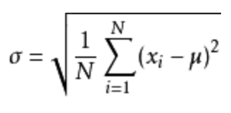
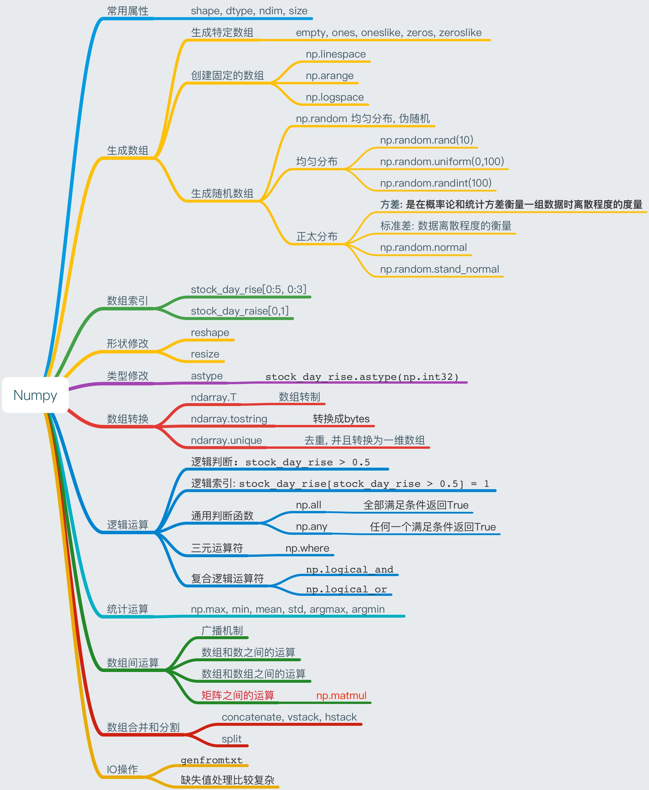

# Numpy

```python
了解Numpy运算速度上的优势
Numpy的数组内存块风格
Numpy的并行化运算
知道数组的属性，形状、类型
应用Numpy实现数组的基本操作（数组生成、索引、切片、形状改变、类型改变、数组转换、去重）
应用随机数组的创建实现正态分布应用
应用Numpy实现数组的逻辑运算
应用Numpy实现数组的统计运算
应用Numpy实现数组之间的运算
应用Numpy实现数组之间合并、分割
应用Numpy的IO操作实现文件的读取、存储
```
## 0、速查

[Numpy中文文档与API](https://www.numpy.org.cn/)
### 0.1 数组的创建
从现有数组创建：
array = np.array([list_1])  # 创建一个一维数组
array = np.array([list_1, list_2])  # 创建一个二维数组
array = np.array([[list_1,list_2],[list_3,list_4]]) # 创建一个三维数组
array = np.asarray(a[, dtype, order])
固定范围数组创建：
array = np.linspace (start, stop, num, endpoint, retstep, dtype)
array = np.arange(start, end, step) # step为步长，step为可选
array = np..logspace(start,stop, num, endpoint, base, dtype)
特殊数组创建：
array = np.random.uniform(low, high, size) # 生成均匀分布的数组
np.random.randint(low, high=None, size=None, dtype='l')
array = np.random.randn(d0, d1, …, dn) # 正态分布
array = np.random.normal(loc=0.0, scale=1.0, size=None) # 正态分布，loc为均值，scale为标准差，size为形状
array = np.zeros(shape[, dtype, order]) # 全 1 数组
array = np.zeros(shape[, dtype, order]) # 全 0 数组
array = np.zeros([m,n]) # 全 0数组，形状为2\*3
array = np.eye(n) # 单位数组，形状为n\*n

### 0.2 数组的属性
array.shape # 返回数组形状
array.size # 返回数组元素个数
array.dtype # 返回数组数据类型

### 0.3 数组的访问
array[n] # 取出数组的第1行/个数据
array[m:n] # 取出第m到n-1行/个数据
array[m][n] #取出数组第m行第n列数据
array[m, n] #取出数组第m行第n列数据
array[:m, n:] # 取出数组第0-m行第0-n列数据

### 0.4 数组的运算
此处的array也可以是数值的切片
array[array > n] # 把array中大于n的标记为True，否则为False
array[array > n] # m # 把array中大于n的标记为m
np.all(array > n) # 判断array中是否全部大于n
np.anyl(array > n) # 判断array中是否有大于n的
np.where(array > n, x , y) # 把array中大于n的设为x，否则设为y
np.where(np.logical_and(temp > n, temp < m), x, y) # 把array中大于n并且小于m的设为x，否则设为y
np.where(np.logical_or(temp > n, temp < m), x, y) # 把array中大于n或者小于m的设为x，否则设为y
np.min(a[, axis, out, keepdims]) # 此外还有max/median/mean/std/var等
np.argmax(temp, axis=)
np.argmin(temp, axis=)


数组之间可以进行算术运算，但矩阵可能不行，2个矩阵之间相乘必须满足m\*n和n\*m
数组之间进行乘法运算，需要满足2个数组维度相等，shape其中相对应的一个地方为1
np.mat(array) # 把array数组转换成matrix矩阵对象

### 0.5 数组常用函数
np.unique(array) # 同行同列不重复的数组
sum(array) # 对数组的列进行相加得出新数组
sum(array[n]) # 返回数组的第n行数据的和
sum(array[:, n]) # 返回数组所有行第n列数据的和
array.max() # 返回数组中最大的数据
max(array) # array为数组的切片，同sum()

### 0.6 数组的合并、分割
np.concatenate((a1, a2, ...), axis=0)
np.hstack(tup) # column wise
np.vstack(tup) # row wise
np.split(ary, indices_or_sections, axis=0)  # 分割

### 0.7 IO操作
np.genfromtxt(fname[, delimiter, dtype, comments, ...]) 

### 0.8 数组的序列化
```python
import pickle
import numpy as np
x = np.arange(10)
f = open('x.pkl', 'wb')
pickle.dump(x, f)
!ls
f = open('x.pkl', 'rb')
pickle.load(f)
np.save('one_array', x)
np.load('one_array.npy')

y = np.arange(20)
np.savez('two_array.npz', a=x, b=y)
c = np.load('two_array.npz')
c['a']
c['b']
```

## 1、Numpy与ndarray介绍
### 1.1 Numpy介绍
Numpy支持常见的数组和矩阵操作，用于**快速处理任意维度的数组**。
NumPy提供了一个N维数组类型`ndarray`，它描述了相同类型的“items”的集合，该对象是一个快速而灵活的大数据容器。
ndarray的数组的存储效率和输入输出性能远优于Python中的嵌套列表，**数组越大，Numpy的优势就越明显**。
**思考**：

> 
> ndarray为什么可以这么快？
> 
```python
# 用ndarray进行存储：
import numpy as np

# 创建ndarray
score = np.array([[80, 89, 86, 67, 79],
[78, 97, 89, 67, 81],
[90, 94, 78, 67, 74],
[91, 91, 90, 67, 69],
[76, 87, 75, 67, 86],
[70, 79, 84, 67, 84],
[94, 92, 93, 67, 64],
[86, 85, 83, 67, 80]])

score

返回结果：
array([[80, 89, 86, 67, 79],
       [78, 97, 89, 67, 81],
       [90, 94, 78, 67, 74],
       [91, 91, 90, 67, 69],
       [76, 87, 75, 67, 86],
       [70, 79, 84, 67, 84],
       [94, 92, 93, 67, 64],
       [86, 85, 83, 67, 80]])
```


### 1.2 ndarray的优势

**（1）内存块风格**

ndarray在存储数据的时候，数据与数据的地址都是连续的，这样就给使得批量操作数组元素时速度更快。


> 这是因为ndarray中的所有元素的类型都是相同的，而Python列表中的元素类型是任意的，所以ndarray在存储元素时内存可以连续，而python原生lis就t只能通过寻址方式找到下一个元素，这虽然也导致了在通用性能方面Numpy的ndarray不及Python原生list，但在科学计算中，Numpy的ndarray就可以省掉很多循环语句，代码使用方面比Python原生list简单的多。
> 

**（2）ndarray支持并行化运算（向量化运算）**
**（3）Numpy底层使用C语言编写，内部解除了GIL（全局解释器锁），其对数组的操作速度不受Python解释器的限制，效率远高于纯Python代码。**

### 1.3 ndarray的属性
数组属性反映了数组本身固有的信息。

| 属性名字         | 属性解释                   |
| ---------------- | -------------------------- |
| ndarray.shape    | 数组维度的元组             |
| ndarray.ndim     | 数组维数                   |
| ndarray.size     | 数组中的元素数量           |
| ndarray.itemsize | 一个数组元素的长度（字节） |
| ndarray.dtype    | 数组元素的类型             |

### 1.4 ndarray的形状
首先创建一些数组。
```python
# 创建不同形状的数组
>>> a = np.array([[1,2,3],[4,5,6]])
>>> b = np.array([1,2,3,4])
>>> c = np.array([[[1,2,3],[4,5,6]],[[1,2,3],[4,5,6]]])

# 分别打印出形状
>>> a.shape
>>> b.shape
>>> c.shape

(2, 3)  # 二维数组
(4,)    # 一维数组
(2, 2, 3) # 三维数组
```

**如何理解数组的形状？**
二维数组：


三维数组：


### 1.5 ndarray的类型
```python
>>> type(score.dtype) //dtype是numpy.dtype类型
<type 'numpy.dtype'>
```
**数组的类型：**

| 名称          | 描述                                              | 简写  |
| ------------- | ------------------------------------------------- | ----- |
| np.bool       | 用一个字节存储的布尔类型（True或False）           | 'b'   |
| np.int8       | 一个字节大小，-128 至 127                         | 'i'   |
| np.int16      | 整数，-32768 至 32767                             | 'i2'  |
| np.int32      | 整数，-2^31 至 2^32 -1                        | 'i4'  |
| np.int64      | 整数，-2^63 至 2^63 - 1                       | 'i8'  |
| np.uint8      | 无符号整数，0 至 255                              | 'u'   |
| np.uint16     | 无符号整数，0 至 65535                            | 'u2'  |
| np.uint32     | 无符号整数，0 至 2^32 - 1                      | 'u4'  |
| np.uint64     | 无符号整数，0 至 2^64 - 1                      | 'u8'  |
| np.float16    | 半精度浮点数：16位，正负号1位，指数5位，精度10位  | 'f2'  |
| np.float32    | 单精度浮点数：32位，正负号1位，指数8位，精度23位  | 'f4'  |
| np.float64    | 双精度浮点数：64位，正负号1位，指数11位，精度52位 | 'f8'  |
| np.complex64  | 复数，分别用两个32位浮点数表示实部和虚部          | 'c8'  |
| np.complex128 | 复数，分别用两个64位浮点数表示实部和虚部          | 'c16' |
| np.object_    | python对象                                        | 'O'   |
| np.string_    | 字符串                                            | 'S'   |
| np.unicode_   | unicode类型                                       | 'U'   |

创建数组的时候指定类型 注意：若不指定，**整数默认int64，小数默认float64**。
```python
a = np.array([[1, 2, 3],[4, 5, 6]], dtype=np.float32)
print(a.dtype) # float32
arr = np.array(['python', 'tensorflow', 'scikit-learn', 'numpy'], dtype = np.string_)
print(arr) # [b'python' b'tensorflow' b'scikit-learn' b'numpy']
```


## 2、数组的基本操作

### 2.1 数组的生成

#### 2.1.1 生成0和1的数组

- empty(shape[, dtype, order]) empty_like(a[, dtype, order, subok])
  eye(N[, M, k, dtype, order])
- identity(n[, dtype])
- **ones(shape[, dtype, order])**
- ones_like(a[, dtype, order, subok])
- **zeros(shape[, dtype, order])** zeros_like(a[, dtype, order, subok])
  full(shape, fill_value[, dtype, order])
- full_like(a, fill_value[, dtype, order, subok])

```python
zero = np.zeros([3, 4])
print(zero)

# 输出结果：
[[0. 0. 0. 0.]
 [0. 0. 0. 0.]
 [0. 0. 0. 0.]]
```

#### 2.1.2 从现有数组生成

- **array(object[, dtype, copy, order, subok, ndmin])**  # **从现有的数组当中创建**
- **asarray(a[, dtype, order])**  # **相当于索引的形式**，并没有真正的创建一个新的
- asanyarray(a[, dtype, order]) ascontiguousarray(a[, dtype])
- asmatrix(data[, dtype])
- **copy(a[, order])**

```python
a = np.array([[1,2,3],[4,5,6]])
a1 = np.array(a)
a2 = np.asarray(a)

# 输出结果：
[[1 2 3]
 [4 5 6]] 
[[1 2 3]
 [4 5 6]]
```

#### #关于array和asarray的不同


### 2.1.3 固定范围数组的生成

- np.**linspace (start, stop, num, endpoint, retstep, dtype)**
生成等间隔的序列
```
start 序列的起始值
stop 序列的终止值，
如果endpoint为true，该值包含于序列中
num 要生成的等间隔样例数量，默认为50
endpoint 序列中是否包含stop值，默认为ture
retstep 如果为true，返回样例，以及连续数字之间的步长
dtype 输出ndarray的数据类型
```

```python
# 生成等间隔的数组
np.linspace(0, 100, 10)

返回结果：
array([  0.        ,  11.11111111,  22.22222222,  33.33333333,
        44.44444444,  55.55555556,  66.66666667,  77.77777778,
        88.88888889, 100.        ])
```

- numpy.**arange(start,stop, step, dtype)**
- numpy.**logspace(start,stop, num, endpoint, base, dtype)**

```python
np.arange(10, 50, 2)

返回结果：
array([10, 12, 14, 16, 18, 20, 22, 24, 26, 28, 30, 32, 34, 36, 38, 40, 42,
       44, 46, 48])
```

### 2.1.4 随机数组的生成

- np.random模块

  - 均匀分布

    - np.**random.rand(*d0*, *d1*, *...*, *dn*)**

      返回**[0.0，1.0)**内的一组均匀分布的数。

    - np.**random.uniform(low=0.0, high=1.0, size=None)**

      功能：从一个均匀分布[low,high)中随机采样，注意定义域是左闭右开，即包含low，不包含high.

      参数介绍:

      low: 采样下界，float类型，默认值为0；

      high: 采样上界，float类型，默认值为1；

      size: 输出样本数目，为int或元组(tuple)类型，例如，size=(m,n,k), 则输出m*n*k个样本，缺省时输出1个值。

      返回值：ndarray类型，其形状和参数size中描述一致。

    - np.**random.randint(*low*, *high=None*, *size=None*, *dtype='l'*)**

      从一个均匀分布中随机采样，生成一个整数或N维整数数组，取数范围：若high不为None时，取[low,high)之间随机整数，否则取值[0,low)之间随机整数。

补充：均匀分布

均匀分布（Uniform Distribution）是概率统计中的重要分布之一。顾名思义，均匀，表示可能性相等的含义。均匀分布在自然情况下极为罕见，而人工栽培的有一定株行距的植物群落即是均匀分布。

```python
# 生成均匀分布的随机数
x1 = np.random.uniform(-1, 1, 100000000)

# 返回结果：
"""
array([ 0.22411206,  0.31414671,  0.85655613, ..., -0.92972446,
0.95985223,  0.23197723])
"""
```

画图看分布状况：

```python
import matplotlib.pyplot as plt

# 生成均匀分布的随机数
x1 = np.random.uniform(-1, 1, 100000000)
# 画图看分布状况
# 1）创建画布
plt.figure(figsize=(10, 10), dpi=100)
# 2）绘制直方图
plt.hist(x1, 1000)
# 3）显示图像
plt.show()
```


- 正态分布

  - np.**random.randn(*d0, d1, …, dn*)**

    功能：从标准正态分布中返回一个或多个样本值

  - np.**random.normal(loc=0.0, scale=1.0, size=None)**

    loc：float

     此概率分布的均值（对应着整个分布的中心centre）

    scale：float

     此概率分布的标准差（对应于分布的宽度，scale越大越矮胖，scale越小，越瘦高）

    size：int or tuple of ints

     输出的shape，默认为None，只输出一个值

  - np.**random.standard_normal(*size=None*)**

    返回指定形状的标准正态分布的数组。

#### 补充：正态分布（理解）

##### 1 什么是正态分布

正态分布是一种概率分布。正态分布是具有两个参数μ和σ的连续型随机变量的分布，第一参数μ是服从正态分布的随机变量的均值，第二个参数σ是此随机变量的方差，所以正态分布记作**N(μ，σ )**。


##### 2 正态分布特点

**μ决定了其位置，其标准差σ**。决定了分布的幅度。当μ = 0,σ = 1时的正态分布是标准正态分布。


标准差如何来？

**3.1 方差**

在概率论和统计学中衡量一组数据离散程度的度量


其中M为平均值，n为数据总个数，S为标准差，S^2可以理解一个整体为方差



**3.2 标准差与方差的意义**

可以理解成数据的一个离散程度的衡量

```python
x2 = np.random.normal(1.75, 1, 100000000)
```

返回结果：

```python
array([2.90646763, 1.46737886, 2.21799024, ..., 1.56047411, 1.87969135,
       0.9028096 ])

# 生成均匀分布的随机数
x2 = np.random.normal(1.75, 1, 100000000)
# 画图看分布状况
# 1）创建画布
plt.figure(figsize=(20, 10), dpi=100)
# 2）绘制直方图
plt.hist(x2, 1000)
# 3）显示图像
plt.show()
```


例如：我们可以模拟生成一组股票的涨跌幅的数据

#### 案例：随机生成8只股票2周的交易日涨幅数据

8只股票，两周(10天)的涨跌幅数据，如何获取？

- 两周的交易日数量为：2 X 5 =10
- 随机生成涨跌幅在某个正态分布内，比如均值0，方差1

**股票涨跌幅数据的创建**

```python
# 创建符合正态分布的8只股票10天的涨跌幅数据
stock_change = np.random.normal(0, 1, (8, 10))
stock_change
```

返回结果：

```python
array([[-0.03862668, -1.46128096, -0.75596237,  0.89737022, -1.86978433,
         0.38845392,  1.14856354, -1.10912275,  1.28900021, -0.86801677],
       [ 1.8701446 ,  0.50407342, -0.74396489, -1.69641331, -0.89969227,
         2.42459765,  0.78987443, -0.82935223,  0.82546455,  0.40524289],
       [-1.7365776 , -0.81501515, -1.08974743, -1.4138561 ,  0.85495155,
         0.30076624, -2.0813311 ,  1.52886975,  0.62945643, -1.48714683],
       [-1.12084983, -0.63070289, -0.20677245, -0.49096973, -0.40551104,
        -0.46320893, -0.73190969,  0.00392486,  2.524498  ,  0.25843191],
       [ 0.05001371,  0.52267878,  1.31974783,  0.64840953,  1.56360431,
        -0.79233575,  1.47275167,  0.61070343, -0.33247221, -0.57492172],
       [ 0.7092757 ,  0.00928591,  0.27008373,  0.79050681, -0.95887888,
         0.03661459,  0.81303927, -0.54139691,  0.69623969,  0.06570421],
       [-1.40481949,  0.49151272,  1.01992235,  1.89152928, -0.76415623,
         0.3100241 ,  1.27156806, -1.76199057, -0.77419965, -0.17574386],
       [-0.21745814, -1.78433763, -0.7953073 ,  0.4765644 , -0.2589575 ,
         0.97014013,  1.67321489,  1.73370987,  0.29886514,  1.27186522]])
```

### 2.2 数组的索引、切片

- 获取第一个股票的前3个交易日的涨跌幅数据

```python
# 二维的数组，两个维度 
stock_change[0, 0:3]
```

返回结果：

```python
array([-0.03862668, -1.46128096, -0.75596237])
```

一维、二维、三维的数组如何索引？

```python
# 三维，一维
a1 = np.array([ [[1,2,3],[4,5,6]], [[12,3,34],[5,6,7]]])
# 返回结果
array([[[ 1,  2,  3],
        [ 4,  5,  6]],

       [[12,  3, 34],
        [ 5,  6,  7]]])
# 索引、切片
>>> a1[0, 0, 1]   # 输出: 2
```

### 2.3 形状修改

需求：让刚才的股票行、日期列反过来，变成日期行，股票列

- **ndarray.reshape(shape[, order]) ** # Returns an array containing the same data with a new shape.

```python
# 在转换形状的时候，一定要注意数组的元素匹配
stock_change.reshape([10, 8]) # 只是将形状进行了修改，但并没有将行列进行转换
stock_change.reshape([-1, 20])  # 数组的形状被修改为: (4, 20), -1: 表示通过待计算
```

- **ndarray.T** 数组的转置
  - 将数组的行、列进行互换

```python
stock_change.shape
(8, 10)
stock_change.T.shape
(10, 8)
```

- **ndarray.resize(new_shape[, refcheck]) ** # Change shape and size of array in-place.

```python
stock_change.resize([10, 8])
print(stock_change)
```
输出结果：
```
[[-0.43193278  0.84518742  0.63440045 -0.41521901  0.1110376  -0.73767188
  -0.50067827 -2.66164875]
 [ 1.43537432 -0.14583019  1.44650107  0.02826041  0.19991829  0.55055975
   0.58447067  0.67817578]
 [ 0.71074499 -0.2235683  -1.11380781 -0.4297913  -1.31152809 -0.07141137
  -0.25824935 -0.25536286]
 [-0.99673384 -0.84881336  0.39453951  0.5221418   0.46490538  1.40631526
   0.39086334 -1.52266742]
 [ 0.02764269  0.88107203  0.34775559 -1.90730469  0.09850422  0.45936684
  -1.18843594  0.78052631]
 [ 0.16427469 -0.96331719 -0.04417191 -0.58761071  1.40023265 -0.06378326
  -0.05307916  0.06268547]
 [ 1.24528569 -0.08127425  0.40482375  0.52307469  0.37989826  0.8037675
  -0.79217522 -1.17198855]
 [-0.32540968 -0.30301177  1.31920942  0.6206224   0.36158828  1.98889942
  -0.23627491 -0.96110046]
 [-0.81902728  2.00117026 -0.34385161 -0.92935034  0.18643584  0.40805214
  -0.95574001  1.58777181]
 [-0.56856861 -1.34785199  1.04067225  1.46738354  0.50392278  0.17897753
   0.10956206  0.52141788]]
```

### 2.4 类型修改

- ndarray.**astype(type)**

```python
stock_change.astype(np.int32)
```

- ndarray.**tostring([order])**或者ndarray.**tobytes([order])** 

  Construct Python bytes containing the raw data bytes in the array.

  - 转换成bytes

```python
arr = np.array([[[1, 2, 3], [4, 5, 6]], [[12, 3, 34], [5, 6, 7]]])
arr.tostring()
```

**拓展：如果遇到**

```python
IOPub data rate exceeded.
    The notebook server will temporarily stop sending output
    to the client in order to avoid crashing it.
    To change this limit, set the config variable
    `--NotebookApp.iopub_data_rate_limit`.
```

这个问题是在jupyer当中对输出的字节数有限制，需要去修改配置文件

创建配置文件

```python
jupyter notebook --generate-config
vi ~/.jupyter/jupyter_notebook_config.py
```

取消注释,多增加

```python
## (bytes/sec) Maximum rate at which messages can be sent on iopub before they
#  are limited.
c.NotebookApp.iopub_data_rate_limit = 10000000
```

**但是不建议这样去修改，jupyter输出太大会崩溃**

### 2.5 数组的去重

- **ndarray.unique**

```python
temp = np.array([[1, 2, 3, 4],[3, 4, 5, 6]])
np.unique(temp)
# 输出：array([1, 2, 3, 4, 5, 6])
```

**问题**
> **如果想要操作符合某一条件的数据，应该怎么做？**


## 3、数组的运算

### 3.1 逻辑运算

```python
# 重新生成8只股票10个交易日的涨跌幅数据
>>> stock_change = np.random.normal(0, 1, (8, 10))
>>> stock_change = stock_change[0:5, 0:5]
# 逻辑判断, 如果涨跌幅大于0.5就标记为True 否则为False
>>> stock_change > 0.5
array([[ True, False, False,  True, False],
       [ True,  True, False, False, False],
       [ True, False,  True, False,  True],
       [False,  True, False, False, False],
       [False, False, False,  True,  True]])
# BOOL赋值, 将满足条件的设置为指定的值-布尔索引
>>> stock_change[stock_change > 0.5] = 1
array([[ 1.        , -0.72404879, -1.33045773,  1.        ,  0.3869043 ],
       [ 1.        ,  1.        ,  0.20815446, -1.67860823,  0.06612823],
       [ 1.        ,  0.42753488,  1.        , -0.24375089,  1.        ],
       [-0.971945  ,  1.        , -0.95444661, -0.2602084 , -0.48736497],
       [-0.32183056, -0.92544956, -0.42126604,  1.        ,  1.        ]])
```

### 3.2 通用判断函数

- np.**all()**

```python
# 判断stock_change[0:2, 0:5]是否全是上涨的
>>> np.all(stock_change[0:2, 0:5] > 0)
False
```

- np.**any()**

```python
# 判断前5只股票这段期间是否有上涨的
>>> np.any(stock_change[0:5, :] > 0 )
True
```

### 3.3 np.where（三元运算符）

通过使用np.where能够进行更加复杂的运算

- np.**where()**

```python
# 判断前四个股票前四天的涨跌幅 大于0的置为1，否则为0
temp = stock_change[:4, :4]
np.where(temp > 0, 1, 0)
# 输出结果：
array([[1, 1, 0, 0],
       [1, 1, 0, 1],
       [1, 1, 1, 1],
       [1, 1, 1, 0]])
```

- 复合逻辑需要结合np.**logical_and**和np.**logical_or**使用

```python
# 判断前四个股票前四天的涨跌幅 大于0.5并且小于1的，换为1，否则为0
np.where(np.logical_and(temp > 0.5, temp < 1), 1, 0)
# 判断前四个股票前四天的涨跌幅 大于0.5或者小于-0.5的，换为1，否则为0
np.where(np.logical_or(temp > 0.5, temp < -0.5), 1, 0)
```

### 3.4 统计运算

**如果想要知道涨幅或者跌幅最大的数据，应该怎么做？**

#### 3.4.1 统计指标

在数据挖掘/机器学习领域，统计指标的值也是我们分析问题的一种方式。常用的指标如下：

- np.**min**(a[, axis, out, keepdims])
  - Return the minimum of an array or minimum along an axis.
- np.**max**(a[, axis, out, keepdims])
  - Return the maximum of an array or maximum along an axis.
- np.**median**(a[, axis, out, overwrite_input, keepdims])
  - Compute the median along the specified axis.
- np.**mean**(a[, axis, dtype, out, keepdims])
  - Compute the arithmetic mean along the specified axis.
- np.**std**(a[, axis, dtype, out, ddof, keepdims])
  - Compute the standard deviation along the specified axis.
- np.**var**(a[, axis, dtype, out, ddof, keepdims])
  - Compute the variance along the specified axis.

#### 3.4.2 股票涨跌幅统计运算

进行统计的时候，**axis 轴的取值并不一定，Numpy中不同的API轴的值都不一样，在这里，axis 0代表列, axis 1代表行去进行统计**

```python
# 接下来对于这4只股票的4天数据，进行一些统计运算
# 指定行 去统计
print("前四只股票前四天的最大涨幅{}".format(np.max(temp, axis=1)))
# 使用min, std, mean
print("前四只股票前四天的最大跌幅{}".format(np.min(temp, axis=1)))
print("前四只股票前四天的波动程度{}".format(np.std(temp, axis=1)))
print("前四只股票前四天的平均涨跌幅{}".format(np.mean(temp, axis=1)))
```

如果需要统计出哪一只股票在某个交易日的涨幅最大或者最小？

- np.**argmax**(temp, axis=)
- np.**argmin**(temp, axis=)

```python
# 获取股票指定哪一天的涨幅最大
print("前四只股票前四天内涨幅最大{}".format(np.argmax(temp, axis=1)))
print("前四天一天内涨幅最大的股票{}".format(np.argmax(temp, axis=0)))
```


## 4、数组间的运算

### 4.1 场景


数据：

```
[[80, 86],
[82, 80],
[85, 78],
[90, 90],
[86, 82],
[82, 90],
[78, 80],
[92, 94]]
```

### 4.2 数组与数的运算

```python
arr = np.array([[1, 2, 3, 2, 1, 4], [5, 6, 1, 2, 3, 1]])
print(arr+1)
# 输出结果：
[[2 3 4 3 2 5]
 [6 7 2 3 4 2]]
print(arr/2)
# 输出结果：
[[0.5 1.  1.5 1.  0.5 2. ]
 [2.5 3.  0.5 1.  1.5 0.5]]

# 可以对比python列表的运算，看出区别
a = [1, 2, 3, 4, 5]
a * 3
# 输出结果：
[1, 2, 3, 4, 5, 1, 2, 3, 4, 5, 1, 2, 3, 4, 5]
```

### 4.3 数组与数组的运算

```python
arr1 = np.array([[1, 2, 3, 2, 1, 4], [5, 6, 1, 2, 3, 1]])
arr2 = np.array([[1, 2, 3, 4], [3, 4, 5, 6]])
```

上面这个能进行运算吗，结果是不行的！

### 4.4 广播机制

**执行 broadcast 的前提在于，两个 ndarray 执行的是 element-wise的运算，Broadcast机制的功能是为了方便不同形状的ndarray（numpy库的核心数据结构）进行数学运算。**

当操作两个数组时，numpy会逐个比较它们的shape（构成的元组tuple），只有在下述情况下，两个数组才能够进行数组与数组的运算。

- 维度相等
- shape（其中相对应的一个地方为1）

例如：

```python
Image (3d array):  256 x 256 x 3
Scale (1d array):              1
Result (3d array): 256 x 256 x 3

A      (4d array):  9 x 1 x 7 x 1
B      (3d array):      8 x 1 x 5
Result (4d array):  9 x 8 x 7 x 5

A      (2d array):  5 x 4
B      (1d array):      1
Result (2d array):  5 x 4

A      (3d array):  15 x 3 x 5
B      (3d array):  15 x 1 x 1
Result (3d array):  15 x 3 x 5
```

如果是下面这样，则不匹配：

```python
A  (1d array): 10
B  (1d array): 12
A  (2d array):      2 x 1
B  (3d array):  8 x 4 x 3
```

**思考：下面两个ndarray是否能够进行运算？**

```python
arr1 = np.array([[1, 2, 3, 2, 1, 4], [5, 6, 1, 2, 3, 1]])
arr2 = np.array([[1], [3]])
```

### 4.5 矩阵运算

现在再次回到最开始的学生成绩问题：


**思考：如何能够直接得出每个学生的成绩？**

#### 4.5.1 什么是矩阵

矩阵，英文matrix，**和array的区别矩阵必须是2维的，但是array可以是多维的。**

- np.**mat()**
  - 将数组转换成矩阵类型

```python
a = np.array([[80, 86],
[82, 80],
[85, 78],
[90, 90],
[86, 82],
[82, 90],
[78, 80],
[92, 94]])
b = np.array([[0.7], [0.3]])

np.mat(a)

# 输出结果：
matrix([[80, 86],
        [82, 80],
        [85, 78],
        [90, 90],
        [86, 82],
        [82, 90],
        [78, 80],
        [92, 94]])
```

#### 4.5.2 矩阵乘法运算

矩阵乘法的两个关键：

- 形状改变
- 运算规则

形状改变：


必须符合上面的式子，否则运算出错。

运算规则：


**矩阵乘法api：**

- np.**matmul**
- np.**dot**

```python
np.matmul(a, b)
np.dot(a,b)
# 输出结果均为：
array([[81.8],
       [81.4],
       [82.9],
       [90. ],
       [84.8],
       [84.4],
       [78.6],
       [92.6]])
```


## 5、数组的合并、分割

**学习目标**

- 应用concatenate、vstack、hstack实现数组合并
- 应用split实现数组的横、纵向分割

### 5.1 合并

- numpy.**concatenate((a1, a2, ...), axis=0)**
- numpy.**hstack(tup)** # Stack arrays in sequence horizontally **(column wise).**
- numpy.**vstack(tup)** # Stack arrays in sequence vertically **(row wise).**

示例：

np.concatenate()：

```python
>>> a = np.array([[1, 2], [3, 4]])
>>> b = np.array([[5, 6]])
>>> np.concatenate((a, b), axis=0)
array([[1, 2],
       [3, 4],
       [5, 6]])
>>> np.concatenate((a, b.T), axis=1)
array([[1, 2, 5],
       [3, 4, 6]])
```

np.hstack()：

```python
>>> a = np.array((1,2,3))
>>> b = np.array((2,3,4))
>>> np.hstack((a, b))
array([1, 2, 3, 2, 3, 4])
>>> a = np.array([[1],[2],[3]])
>>> b = np.array([[2],[3],[4]])
>>> np.hstack((a, b))
array([[1, 2],
       [2, 3],
       [3, 4]])
```

np.vstack()

```python
>>> a = np.array([1, 2, 3])
>>> b = np.array([2, 3, 4])
>>> np.vstack((a, b))
array([[1, 2, 3],
       [2, 3, 4]])

>>> a = np.array([[1], [2], [3]])
>>> b = np.array([[2], [3], [4]])
>>> np.vstack((a, b))
array([[1],
       [2],
       [3],
       [2],
       [3],
       [4]])
```

比如我们将两部分股票的数据拼接在一起：

```python
a = stock_change[:2, 0:4]
b = stock_change[4:6, 0:4]
# axis=1时候，按照数组的列方向拼接在一起
# axis=0时候，按照数组的行方向拼接在一起
np.concatenate([a, b], axis=0)
# np.hstack([a, b])
np.vstack([a, b])
```

### 5.2 分割

- numpy.**split(ary, indices_or_sections, axis=0)** # Split an array into multiple sub-arrays.

```python
>>> x = np.arange(9.0)
array([0., 1., 2., 3., 4., 5., 6., 7., 8.])
>>> np.split(x, 3)
[array([ 0.,  1.,  2.]), array([ 3.,  4.,  5.]), array([ 6.,  7.,  8.])]
>>> x = np.arange(8.0)
array([0., 1., 2., 3., 4., 5., 6., 7.])
>>> np.split(x, [3, 5, 6, 10])
[array([ 0.,  1.,  2.]),
 array([ 3.,  4.]),
 array([ 5.]),
 array([ 6.,  7.]),
 array([], dtype=float64)]
```


## 6、IO操作与数据处理

**学习目标：**

- Numpy读取
- 如何处理缺失值

**问题：**

大多数数据并不是我们自己构造的，而是存在文件当中，需要我们用工具获取。

但是Numpy其实并不适合用来读取和处理数据，因此我们这里了解相关API，以及Numpy不方便的地方即可。

### 6.1 Numpy读取

- **genfromtxt(fname[, dtype, comments, ...])**  # Load data from a text file, with missing values handled as specified.


```python
# 读取数据
test = np.genfromtxt("test.csv", delimiter=',')
```

返回结果：

```python
array([[  nan,   nan,   nan,   nan],
       [  1. , 123. ,   1.4,  23. ],
       [  2. , 110. ,   nan,  18. ],
       [  3. ,   nan,   2.1,  19. ]])
```

### 6.2 如何处理缺失值

#### 6.2.1 什么是缺失值

什么时候numpy中会出现nan：当我们读取本地的文件为float的时候，如果有缺失(或者为None)，就会出现nan

#### 6.2.2 缺失值处理

那么，在一组数据中单纯的把nan替换为0，合适么？会带来什么样的影响？

比如，全部替换为0后，替换之前的平均值如果大于0，替换之后的均值肯定会变小，所以更一般的方式是把缺失的数值替换为均值（中值）或者是直接删除有缺失值的一行

所以：

- 如何计算一组数据的中值或者是均值
- 如何删除有缺失数据的那一行（列）**在pandas中介绍**

```python
t中存在nan值，如何操作把其中的nan填充为每一列的均值
t = array([[  0.,   1.,   2.,   3.,   4.,   5.],
       [  6.,   7.,  nan,   9.,  10.,  11.],
       [ 12.,  13.,  14.,  nan,  16.,  17.],
       [ 18.,  19.,  20.,  21.,  22.,  23.]])
```

处理逻辑：

```python
def fill_nan_by_column_mean(t):
    for i in range(t.shape[1]):
        # 计算nan的个数
        nan_num = np.count_nonzero(t[:, i][t[:, i] != t[:, i]])
        if nan_num > 0:
            now_col = t[:, i]
            # 求和
            now_col_not_nan = now_col[np.isnan(now_col) == False].sum()
            # 计算出均值=和/个数
            now_col_mean = now_col_not_nan / (t.shape[0] - nan_num)
            # 赋值给now_col
            now_col[np.isnan(now_col)] = now_col_mean
            # 赋值给t，即更新t的当前列
            t[:, i] = now_col
    return t
```

看了上面的处理过程，非常麻烦，别担心之后我们会介绍强大的Pandas工具进行处理！


## 7、 总结
**7.1 总结**


**7.2 每日作业**
（1）练习矩阵相乘
（2）练习数组索引
（3）练习数组形状修改


## 8、遗留问题

### 8.1 DataFrame的iterrows

```python
data = {
    'Country': ['China', 'India', 'Brazil'],
    'Capital': ['Beijing', 'New Delhi', 'Brasilia'],
    'Population': ['1432732201', '1303171635', '207847528']
}
df = DataFrame(data)
# 1
for row in df.iterrows():
    print(row)
# 2
for row in df.iterrows():
    print(row[0], row[1])
    break
# 2种输出结果一样
```

问题：iterrows到底是什么


### 8.2 pd.read_clipboard()的语法


