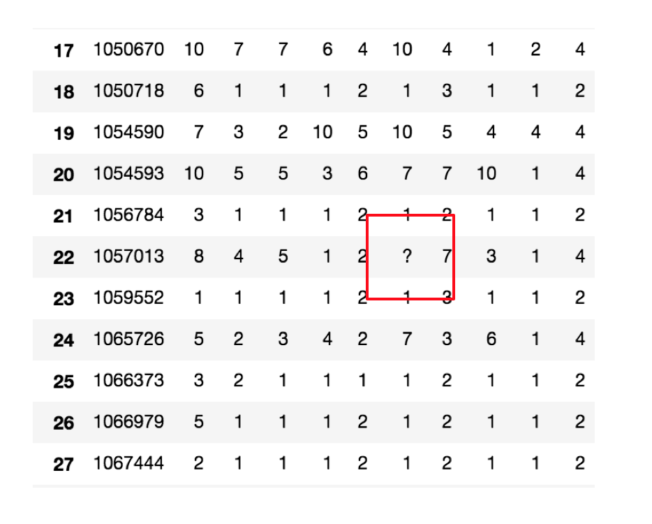
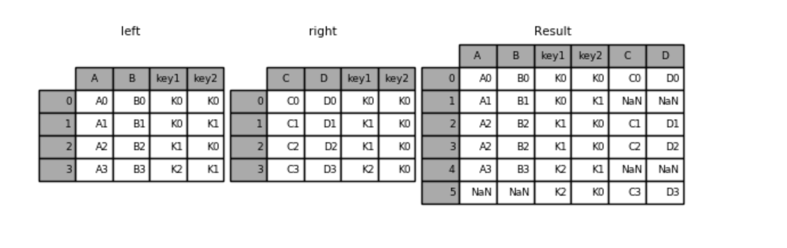
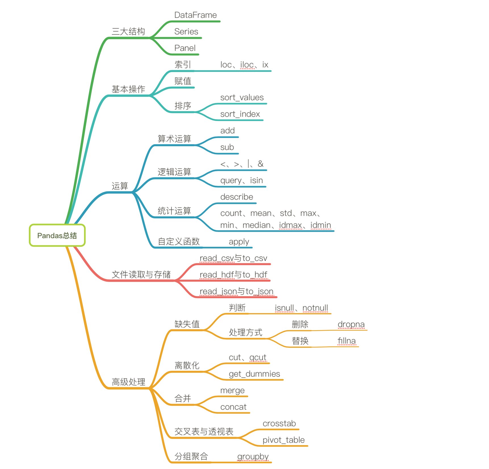

# Pandas

```python
了解Numpy与Pandas的不同
说明Pandas的Series与Dataframe两种结构的区别
了解Pandas的MultiIndex与panel结构
应用Pandas实现基本数据操作
应用Pandas实现数据的统计分析
应用Pandas实现数据的逻辑筛选
应用Pandas实现数据的算数运算
应用Pandas实现数据的缺失值处理
应用Pandas实现数据的离散化处理
应用Pandas实现数据的合并
应用crosstab和pivot_table实现交叉表与透视表
应用groupby和聚合函数实现数据的分组与聚合
了解Pandas的plot画图功能
应用Pandas实现数据的读取和存储
```

## 0、速查
Pandas的API：
[Pandas中文文档&API](https://www.pypandas.cn/)
[Pandas官方API](http://pandas.pydata.org/pandas-docs/stable/reference/index.html)


### 导包

- import pandas as pd
- import numpy as np

### 导入数据

- pd.read_csv(filename)：从CSV文件导入数据
- pd.read_table(filename)：从限定分隔符的文本文件导入数据
- pd.read_excel(filename)：从Excel文件导入数据
- pd.read_sql(query, connection_object)：从SQL表/库导入数据
- pd.read_json(json_string)：从JSON格式的字符串导入数据
- pd.read_html(url)：解析URL、字符串或者HTML文件，抽取其中的tables表格
- pd.read_clipboard()：从你的粘贴板获取内容，并传给read_table()
- pd.DataFrame(dict)：从字典对象导入数据，Key是列名，Value是数据

### 导出数据

- df.to_csv(filename)：导出数据到CSV文件
- df.to_excel(filename)：导出数据到Excel文件
- df.to_sql(table_name, connection_object)：导出数据到SQL表
- df.to_json(filename)：以Json格式导出数据到文本文件

### 创建测试对象

- pd.DataFrame(np.random.rand(20,5))：创建20行5列的随机数组成的DataFrame对象
- pd.Series(my_list)：从可迭代对象my_list创建一个Series对象
- df.index = pd.date_range('1900/1/30', periods=df.shape[0])：增加一个日期索引

### 查看、检查数据

- df.head(n)：查看DataFrame对象的前n行
- df.tail(n)：查看DataFrame对象的最后n行
- df.shape()：查看行数和列数
- df.info()：查看索引、数据类型和内存信息
- df.describe()：查看数值型列的汇总统计
- s.value_counts(dropna=False)：查看Series对象的唯一值和计数
- df.apply(pd.Series.value_counts)：查看DataFrame对象中每一列的唯一值和计数

### 数据选取

- df[col]：根据列名，并以Series的形式返回列
- df[[col1, col2]]：以DataFrame形式返回多列
- s.iloc[0]：按位置选取数据
- s.loc['index_one']：按索引选取数据
- df.iloc[0,:]：返回第一行
- df.iloc[0,0]：返回第一列的第一个元素
- df.values[:,:-1]:返回除了最后一列的其他列的所以数据
- df.query('[1, 2] not in c'): 返回c列中不包含1，2的其他数据集

### 数据清理

- df.columns = ['a','b','c']：重命名列名
- pd.isnull()：检查DataFrame对象中的空值，并返回一个Boolean数组
- pd.notnull()：检查DataFrame对象中的非空值，并返回一个Boolean数组
- df.dropna()：删除所有包含空值的行
- df.dropna(axis=1)：删除所有包含空值的列
- df.dropna(axis=1,thresh=n)：删除所有小于n个非空值的行
- df.fillna(x)：用x替换DataFrame对象中所有的空值
- s.astype(float)：将Series中的数据类型更改为float类型
- s.replace(1,'one')：用‘one’代替所有等于1的值
- s.replace([1,3],['one','three'])：用'one'代替1，用'three'代替3
- df.rename(columns=lambda x: x + 1)：批量更改列名
- df.rename(columns={'old_name': 'new_ name'})：选择性更改列名
- df.set_index('column_one')：更改索引列
- df.rename(index=lambda x: x + 1)：批量重命名索引

### 数据处理：Filter、Sort和GroupBy

- df[df[col] > 0.5]：选择col列的值大于0.5的行
- df.sort_values(col1)：按照列col1排序数据，默认升序排列
- df.sort_values(col2, ascending=False)：按照列col1降序排列数据
- df.sort_values([col1,col2], ascending=[True,False])：先按列col1升序排列，后按col2降序排列数据
- df.groupby(col)：返回一个按列col进行分组的Groupby对象
- df.groupby([col1,col2])：返回一个按多列进行分组的Groupby对象
- df.groupby(col1)[col2]：返回按列col1进行分组后，列col2的均值
- df.pivot_table(index=col1, values=[col2,col3], aggfunc=max)：创建一个按列col1进行分组，并计算col2和col3的最大值的数据透视表
- df.groupby(col1).agg(np.mean)：返回按列col1分组的所有列的均值
- data.apply(np.mean)：对DataFrame中的每一列应用函数np.mean
- data.apply(np.max,axis=1)：对DataFrame中的每一行应用函数np.max

### 数据合并

- df1.append(df2)：将df2中的行添加到df1的尾部
- df.concat([df1, df2],axis=1)：将df2中的列添加到df1的尾部
- df1.join(df2,on=col1,how='inner')：对df1的列和df2的列执行SQL形式的join

### 数据统计

- df.describe()：查看数据值列的汇总统计
- df.mean()：返回所有列的均值
- df.corr()：返回列与列之间的相关系数
- df.count()：返回每一列中的非空值的个数
- df.max()：返回每一列的最大值
- df.min()：返回每一列的最小值
- df.median()：返回每一列的中位数
- df.std()：返回每一列的标准差


## 1、DataFrame

### 1.1 语法

- **pd.DataFrame(x, index=, columns=)**
```python
# 创建一个符合正态分布的10个股票5天的涨跌幅数据
stock_change = np.random.normal(0, 1, (10, 5))

# 构造行索引序列
stock_code = ['股票' + str(i) for i in range(stock_change.shape[0])]
# 添加行索引
stock_change = pd.DataFrame(stock_change, index=stock_code)

# 生成一个时间的序列，略过周末非交易日
date = pd.date_range('2017-01-01', periods=stock_change.shape[1], freq='B')

# index代表行索引，columns代表列索引
stock_change = pd.DataFrame(stock_change, index=stock_code, columns=date)
```
### 1.2 结构
既有行索引又有列索引的二维数组

### 1.3 属性
- shape：形状

```python
data.shape
```

- 行列索引：index, columns

```python
# 行索引
data.index
# 列索引
data.columns
```

- values值

```python
data.values # 直接获取其中array的值
```

- T转置

```python
# 行列转置
data.T
```
### 1.4 常用方法
- head()

- tail()

```python
# head(args)默认返回前5条，args指定返回条数
data.head(3)
# tail(args)默认返回后5条，args指定返回条数
data.tail(3)
```
### 1.5 DataFrame索引的设置
- **1）修改行列索引值**

```python
# stock_change.index[3] = "股票007" 不支持单个索引的修改
# 重新构造行索引
new_stock = ["股票00{}".format(i) for i in range(10)]
stock_change.index = new_stock
```

- **2）重设索引**

data.**reset_index**(drop=False) 

- drop:默认为False，不删除原来索引，如果为True,删除原来的索引值

```python
# 重设索引
stock_change.reset_index(drop=False)
```

- **3）设置新索引**

data.**set_index**(keys, frop=True)
- **keys** : 列索引名成或者列索引名称的列表
- **drop** : boolean, default True.当做新的索引，删除原来的列

```python
df = pd.DataFrame({'month': [1, 4, 7, 10],
'year': [2012, 2014, 2013, 2014],
'sale':[55, 40, 84, 31]})

# 以month作为新的索引
df1 = df.set_index("month")

# 将年份、月份都作为索引
df2 = df.set_index(["year", "month"])
```

## 2、MultiIndex与Panel
- 存储三维数据的结构
- Panel看成是DataFrame的容器
- Pandas从版本0.20.0开始弃用：**推荐**的用于表示3D数据的方法是DataFrame上的**MultiIndex**方法

**2.1 MultiIndex**

- index属性

    - names：levels的名称

    - levels：每个level的元组值

    ```python
    df.index.names
    FrozenList(['year', 'month'])

    df.index.levels
    FrozenList([[2012, 2013, 2014], [1, 4, 7, 10]])
    ```

**2.2 Panel**
- class pandas.Panel(data=None, items=None, major_axis=None, minor_axis=None, copy=False, dtype=None)
    - 存储3维数组的Panel结构
    - *items* - `axis 0`，每个项目对应于内部包含的数据帧(DataFrame)。
    - *major_axis* - `axis 1`，它是每个数据帧(DataFrame)的索引(行)。
    - *minor_axis* - `axis 2`，它是每个数据帧(DataFrame)的列。

    ```python
    p = pd.Panel(np.arange(24).reshape(4,3,2),
                     items=list('ABCD'),
                     major_axis=pd.date_range('20130101', periods=3),
                     minor_axis=['first', 'second'])
    p["A"]
    p.major_xs("20130101")
    p.minor_xs("first")
    ```

## 3、Series
**3.1 结构**

- 带行索引的一维数组,Series结构只有行索引

- DataFrame可以看成是Series的容器

**3.2 创建Series：pd.Series()**

- 通过已有数据创建
    - 指定内容，默认索引
    ```python
    pd.Series(np.arange(10))
    ```
    - 指定索引
    ```python
    pd.Series([6.7, 5.6, 3, 10, 2], index=[1, 2, 3, 4, 5])
    ```
- 通过字典数据创建
    ```python
    pd.Series({'red':100, 'blue':200, 'green': 500, 'yellow':1000})
    ```

**3.3 Series获取索引和值**

- index
- values

## 4、基本数据操作
### 4.1 索引操作

- 直接使用行列索引(先列后行)
```python
# 直接使用行列索引名字的方式（先列后行）
data['open']['2018-02-27']

# 不支持的操作
# 错误
data['2018-02-27']['open']
# 错误
data[:1, :2]
```
- 结合loc或者iloc使用索引
```python
# 使用loc:只能指定行列索引的名字
data.loc['2018-02-27':'2018-02-22', 'open']

# 使用iloc可以通过索引的下标去获取
# 获取前100天数据的'open'列的结果
data.iloc[0:100, 0:2].head()
```
- 使用ix组合索引
```python
# 使用ix进行下表和名称组合做引
data.ix[0:4, ['open', 'close', 'high', 'low']]

# 推荐使用loc和iloc来获取的方式
data.loc[data.index[0:4], ['open', 'close', 'high', 'low']]
data.iloc[0:4, data.columns.get_indexer(['open', 'close', 'high', 'low'])]
```

### 4.2 赋值操作

```python
# 直接修改原来的值
data['close'] = 1
# 或者
data.close = 1
```

### 4.3 排序

- 对值进行排序
  - 使用df.sort_values(key=, ascending=)对内容进行排序
    - 单个键或者多个键进行排序,默认升序
    - ascending=False:降序
    - ascending=True:升序
    ```python
    # 按照涨跌幅大小进行排序 , 使用ascending指定按照大小排序
    data = data.sort_values(by='p_change', ascending=False).head()
    # 按照多个键进行排序
    data = data.sort_values(by=['open', 'high'])
    ```
  - 使用series.sort_values(ascending=True)对内容进行排序
		- series排序时，只有一列，不需要参数
    ```python
    data['p_change'].sort_values(ascending=True).head()
    ```

- 对索引进行排序
    - 使用df.sort_index对索引进行排序
        ```python
        # 这个股票的日期索引原来是从大到小，现在重新排序，从小到大
        # 对索引进行排序
        data.sort_index()
        ```
    - 使用series.sort_index()对索引进行排序，与df一致
        ```python
        data['p_change'].sort_index().head()
        ```

## 5、DataFrame运算
### 5.1 算术运算
- add(other)
- sub(other)
    ```python
    data['open'].add(1)
    # 2、收盘价减去开盘价
    data['m_price_change'] = close.sub(open1)
    ```

### 5.2 逻辑运算

- 1）逻辑运算符<、 >、|、 & -- 布尔索引
    ```python
    # 一个逻辑判断
    data['p_change'] > 2
    # 多个逻辑判断
    data[(data['p_change'] > 2) & (data['open'] > 15)]
    ```

- 2）逻辑运算函数
    - dataframe.query("查询语句")
    - sr.isin([])
    ```python
    # query
    data.query("p_change > 2 & turnover > 15")
    # 可以指定值进行一个判断，从而进行筛选操作
    data[data['turnover'].isin([4.19, 2.39])]
    ```

### 5.3 统计运算

- **1）describe()**

    - 综合分析: 能够直接得出很多统计结果,count, mean, std, min, max 等
    ```python
    data.describe()
    ```

- **2）统计指标函数**

    | `count`  | Number of non-NA observations                  |
    | -------- | ---------------------------------------------- |
    | `sum`    | **Sum of values**                              |
    | `mean`   | **Mean of values**                             |
    | `median` | Arithmetic median of values                    |
    | `min`    | **Minimum**                                    |
    | `max`    | **Maximum**                                    |
    | `mode`   | Mode                                           |
    | `abs`    | Absolute Value                                 |
    | `prod`   | Product of values                              |
    | `std`    | **Bessel-corrected sample standard deviation** |
    | `var`    | **Unbiased variance**                          |
    | `idxmax` | compute the index labels with the maximum      |
    | `idxmin` | compute the index labels with the minimum      |

    **对于单个函数去进行统计的时候，坐标轴还是按照这些默认为“columns” (axis=0, default)，如果要对行“index” 需要指定(axis=1)**

    ```python
    # 使用统计函数：0 代表列求结果， 1 代表行求统计结果
    data.max(0)
    ```
    
- **3）最大与最小值的位置：**
    - numpy
        - np.argmax() # # 求出最大值的位置
        - np.argmin() # 求出最小值的位置
    - pandas:
        - df.idxmax() ## 求出最大值的位置
        - df.idxmin() # 求出最小值的位置

### 5.4 累计统计函数

| 函数      | 作用                        |
| --------- | --------------------------- |
| `cumsum`  | **计算前1/2/3/…/n个数的和** |
| `cummax`  | 计算前1/2/3/…/n个数的最大值 |
| `cummin`  | 计算前1/2/3/…/n个数的最小值 |
| `cumprod` | 计算前1/2/3/…/n个数的积     |

```python
stock_rise = data['p_change']
# plot方法集成了前面直方图、条形图、饼图、折线图
stock_rise.cumsum()
```

### 5.5 自定义运算

- apply(func, axis=0)
    - func:自定义函数
    - axis=0:默认是列，axis=1为行进行运算
- 定义一个对列，最大值-最小值的函数

```python
data[['open', 'close']].apply(lambda x: x.max() - x.min(), axis=0)
```

## 6、Pandas画图

**6.1 pandas.DataFrame.plot**

- `DataFrame.plot`(*x=None*, *y=None*, *kind='line'*)
  - x : label or position, default None
  - y : label, position or list of label, positions, default None
    - Allows plotting of one column versus another
  - **kind : str**
    - **‘line’** : 折线图（默认）
    - **‘bar’** : 垂直柱状图，加上stacked=True，为堆叠柱状图
    - **‘barh’** : 水平柱状图
    - **‘hist’** : 直方图
    - **‘pie’** : 饼图
    - **‘scatter’** : 散点图
    - '**area**'：堆积面积图
    - '**kde**'：密度图

> 更多参数细节：<https://pandas.pydata.org/pandas-docs/stable/generated/pandas.DataFrame.plot.html?highlight=plot#pandas.DataFrame.plot>

**6.2 pandas.Series.plot**

> 更多参数细节：<https://pandas.pydata.org/pandas-docs/stable/generated/pandas.Series.plot.html?highlight=plot#pandas.Series.plot>


## 7、文件读取与存储

**最常用的HDF5和CSV文件**


### 7.1 CSV

- **pandas.read_csv**(filepath_or_buffer, sep =',' , delimiter = None) # 读取文件
    - **filepath_or_buffer**:文件路径
    - **usecols**:指定读取的列名，列表形式

- **DataFrame.to_csv**(path_or_buf=None, sep=', ’, columns=None, header=True, index=True, index_label=None, mode='w', encoding=None) # 写入文件
    - path_or_buf :string or file handle, default None
    - sep :character, default ‘,’
    - columns :sequence, optional
    - **mode**:'w'：重写, 'a' 追加
    - 以追加方式添加数据的时候，一定要去掉列名columns,指定header=False
    - **index**:是否写进行索引
    - **header**:boolean or list of string, default True,是否写进列索引值

- **Series.to_csv**(*path=None*, *index=True*, *sep='*, *'*, *na_rep=''*, *float_format=None*, *header=False*, *index_label=None*, *mode='w'*, *encoding=None*, *compression=None*, *date_format=None*, *decimal='.'*)

```python
# 读取文件,并且指定只获取'open', 'high', 'close'指标
data = pd.read_csv("./stock_day.csv", usecols=['open', 'high', 'close'])
# 选取10行数据保存
data[:10].to_csv("./test.csv", columns=['open'])
```

### 7.2 HDF5

**HDF5文件的读取和存储需要指定一个键，值为要存储的DataFrame**

    - **pandas.read_hdf**(path_or_buf，key =None，** kwargs)
    - path_or_buffer:文件路径
    - key:读取的键
    - mode:打开文件的模式
    - return:Theselected object

- **DataFrame.to_hdf**(path_or_buf, *key*, **\*kwargs*)

```python
# 读取文件
day_high = pd.read_hdf("./stock_data/day/day_high.h5")

# 存储文件
day_high.to_hdf("./test.h5", key="day_high")

# 再次读取的时候, 需要指定键的名字
new_high = pd.read_hdf("./test.h5", key="day_high")
```

### 7.3 json

- pandas.read_json(path_or_buf=None, orient=None, typ='frame', lines=False)
    - 将JSON格式准换成默认的Pandas DataFrame格式
    - orient : string,Indication of expected JSON string format.
        - 'split' : dict like {index -> [index], columns -> [columns], data -> [values]}
        - **'records' : list like [{column -> value}, ... , {column -> value}]**
        - 'index' : dict like {index -> {column -> value}}
        - **'columns' : dict like {column -> {index -> value}}**,默认该格式
        - 'values' : just the values array
    - lines : boolean, default False
        - 按照每行读取json对象
    - typ : default ‘frame’， 指定转换成的对象类型series或者dataframe

- DataFrame.to_json(path_or_buf=None, orient=None, lines=False)
    - 将Pandas 对象存储为json格式
    - *path_or_buf=None*：文件地址
    - orient:存储的json形式，{‘split’,’records’,’index’,’columns’,’values’}
    - lines:一个对象存储为一行

```python
# 读取
orient指定存储的json格式，lines指定按行作为一个样本
json_read = pd.read_json("Sarcasm_Headlines_Dataset.json", orient="records", lines=True)
# 存储文件
json_read.to_json("./test.json", orient='records')
# 修改lines参数为True
json_read.to_json("./test.json", orient='records', lines=True)
```


**优先选择使用HDF5文件存储**

- HDF5在存储的是支持压缩，**使用的方式是blosc，这个是速度最快**的，也是pandas默认支持的
- 使用压缩可以**提磁盘利用率，节省空间**
- HDF5还是跨平台的，可以轻松迁移到hadoop 上面


## 8、缺失值处理

- 判断数据**是否为NaN**：**pd.isnull(df)**, **pd.notnull(df)**

- 存在缺失值nan, 并且是np.nan:
  - **删除存在缺失值**的：**dropna(axis='rows')**
    - 注：不会修改原数据，需要接受返回值
  - **替换缺失值**：**fillna(value, inplace=True)**
    - value：替换成的值
    - inplace：
      - True：会修改原数据
      - False：不替换修改原数据，生成新的对象
- 不是缺失值nan，有默认标记的
    

    - 先替换'?'为np.nan
      - df.replace(to_replace=, value=)
        - to_replace:替换前的值
        - value:替换后的值

        ```python
        # 把一些其它值标记的缺失值，替换成np.nan
        wis = wis.replace(to_replace='?', value=np.nan)
        ```

    - 再进行缺失值的处理


## 9、数据离散化

连续属性离散化的目的是为了简化数据结构，**数据离散化技术可以用来减少给定连续属性值的个数**。离散化方法经常作为数据挖掘的工具。

### 9.1 什么是数据的离散化

**连续属性的离散化就是将连续属性的值域上，将值域划分为若干个离散的区间，最后用不同的符号或整数** **值代表落在每个子区间中的属性值。**

离散化有很多种方法，这使用一种最简单的方式去操作

- 原始的身高数据：165，174，160，180，159，163，192，184
- 假设按照身高分几个区间段：(150, 165], (165, 180], (180, 195]

这样我们将数据分到了三个区间段，我可以对应的标记为矮、中、高三个类别，最终要处理成一个“哑变量”矩阵。


### 9.2 如何实现数据的离散化

**流程：**

- 对数据进行分组

  - 自动分组：pd.qcut(data, bins)
  - 自定义分组：pd.cut(data, bins)
  - 对数据进行分组：将数据分组 一般会与value_counts搭配使用，统计每组的个数
    - series.value_counts()：统计分组次数

- 将分好组的数据变成one-hot哑变量编码矩阵
  - pandas.get_dummies(data, prefix=None)
    - data:array-like, Series, or DataFrame
    - prefix:分组名字
    - 即将数据变成one-hot编码矩阵

```python
import pandas as pd
# 1、准备数据
data = pd.Series([165,174,160,180,159,163,192,184], index=['No1:165', 'No2:174','No3:160', 'No4:180', 'No5:159', 'No6:163', 'No7:192', 'No8:184']) 
data
```

返回结果：

```python
No1:165    165
No2:174    174
No3:160    160
No4:180    180
No5:159    159
No6:163    163
No7:192    192
No8:184    184
dtype: int64
# 自定义分组参数
bins = [150, 165, 180, 195]
# 2、对数据进行分组(相当于进行分类)
cut = pd.cut(data, bins)
cut
```

返回结果：

```python
No1:165    (150, 165]
No2:174    (165, 180]
No3:160    (150, 165]
No4:180    (165, 180]
No5:159    (150, 165]
No6:163    (150, 165]
No7:192    (180, 195]
No8:184    (180, 195]
dtype: category
Categories (3, interval[int64]): [(150, 165] < (165, 180] < (180, 195]]
# 求各个分组(分类)的个数
pcounts = cut.value_counts()
pcounts
```

返回结果：

```python
(150, 165]    4
(180, 195]    2
(165, 180]    2
dtype: int64
# 3、对分组数据 求哑变量矩阵
dummies = pd.get_dummies(cut, prefix='身高')
dummies
```

返回结果：

|         | 身高_(150, 165] | 身高_(165, 180] | 身高_(180, 195] |
| ------- | --------------- | --------------- | --------------- |
| No1:165 | 1               | 0               | 0               |
| No2:174 | 0               | 1               | 0               |
| No3:160 | 1               | 0               | 0               |
| No4:180 | 0               | 1               | 0               |
| No5:159 | 1               | 0               | 0               |
| No6:163 | 1               | 0               | 0               |
| No7:192 | 0               | 0               | 1               |
| No8:184 | 0               | 0               | 1               |


## 10、数据的合并
如果你的数据由多张表组成，那么有时候需要将不同的内容合并在一起分析
- concat：进行按照索引的合并
- merge：进行按照键合并

### 10.1 pd.concat实现合并

- pd.concat([data1, data2], axis=1)
  - 按照行或列进行合并,axis=0为列索引，axis=1为行索引

比如我们将刚才处理好的one-hot编码与原数据合并


```python
# 按照行索引进行
pd.concat([data, dummies], axis=1)
```

### 10.2 pd.merge实现合并

- pd.merge(left, right, how='inner', on=None, left_on=None, right_on=None,left_index=False, right_index=False, sort=True,suffixes=('_x', '_y'), copy=True, indicator=False,validate=None)
  - 可以指定按照两组数据的共同键值对合并或者左右各自
  - `left`: A DataFrame object
  - `right`: Another DataFrame object
  - `on`: Columns (names) to join on. Must be found in both the left and right DataFrame objects.
  - left_on=None, right_on=None：指定左右键

| Merge method | SQL Join Name      | Description                               |
| ------------ | ------------------ | ----------------------------------------- |
| `left`       | `LEFT OUTER JOIN`  | Use keys from left frame only             |
| `right`      | `RIGHT OUTER JOIN` | Use keys from right frame only            |
| `outer`      | `FULL OUTER JOIN`  | Use union of keys from both frames        |
| `inner`      | `INNER JOIN`       | Use intersection of keys from both frames |

**示例：**

```
left = pd.DataFrame({'key1': ['K0', 'K0', 'K1', 'K2'],
                        'key2': ['K0', 'K1', 'K0', 'K1'],
                        'A': ['A0', 'A1', 'A2', 'A3'],
                        'B': ['B0', 'B1', 'B2', 'B3']})

right = pd.DataFrame({'key1': ['K0', 'K1', 'K1', 'K2'],
                        'key2': ['K0', 'K0', 'K0', 'K0'],
                        'C': ['C0', 'C1', 'C2', 'C3'],
                        'D': ['D0', 'D1', 'D2', 'D3']})

# 默认内连接
result = pd.merge(left, right, on=['key1', 'key2'])
```


- 左连接

```python
result = pd.merge(left, right, how='left', on=['key1', 'key2'])
```


- 右连接

```python
result = pd.merge(left, right, how='right', on=['key1', 'key2'])
```


- 外链接

```python
result = pd.merge(left, right, how='outer', on=['key1', 'key2'])
```




## 11、交叉表&透视表
交叉表与透视表是对数据的进一步挖掘。

### 11.1 使用crosstab(交叉表)实现

- 交叉表：**交叉表用于计算一列数据对于另外一列数据的分组个数(寻找两个列之间的关系)**

  - **pd.crosstab(value1, value2)**

**（1）数据准备**

- 准备两列数据，星期数据以及涨跌幅是好是坏数据
- 进行交叉表计算

```python
# 寻找星期几跟股票涨跌的关系
# 1、先根据对应的日期找到星期几
date = pd.to_datetime(data.index).weekday
data['week'] = date

# 2、把p_change按照大小分类，以0为界限
data['posi_neg'] = np.where(data['p_change'] > 0, 1, 0)

# 通过交叉表找寻两列数据的关系
count = pd.crosstab(data['week'], data['posi_neg'])
```

但是我们看到count只是每个星期日子的好坏天数，并没有得到比例，该怎么去做？

- 对于每个星期一等的总天数求和，运用除法运算求出比例

```python
# 算数运算，先求和
count.sum(axis=1).astype(np.float32)

# 进行相除操作，得出比例
pro = count.div(count.sum(axis=1).astype(np.float32), axis=0)
```

**（2）查看效果**

使用plot画出这个比例，使用stacked的柱状图

```python
pro.plot(kind='bar', stacked=True)
plt.show()
```

### 11.2 使用pivot_table(透视表)实现

- **DataFrame.pivot_table([], index=[])**

使用透视表，刚才的过程更加简单

```python
# 通过透视表，将整个过程变成更简单一些
data.pivot_table(['posi_neg'], index=['week'])
```


## 12、数据的分组与聚合
**使用groupby和聚合函数实现数据的分组与聚合**
分组与聚合通常是分析数据的一种方式，通常与一些统计函数一起使用，查看数据的分组情况

交叉表与透视表也有分组的功能，算是分组的一种形式，只不过他们主要是计算次数或者计算比例！！看其中的效果：


仔细观察这个结构，会发现与前面的MultiIndex结构类似。

**什么是分组与聚合**


**分组与聚合API**

- **DataFrame.groupby**(key, as_index=False)
  - key:分组的列数据，可以多个

```python
# 案例:不同颜色的不同笔的价格数据
col =pd.DataFrame({'color': ['white','red','green','red','green'], 'object': ['pen','pencil','pencil','ashtray','pen'],'price1':[5.56,4.20,1.30,0.56,2.75],'price2':[4.75,4.12,1.60,0.75,3.15]})

# 进行分组，对颜色分组，price进行聚合
col.groupby(['color'])['price1'].mean()
col['price1'].groupby(col['color']).mean()

# 分组，数据的结构不变
col.groupby(['color'], as_index=False)['price1'].mean()

# 输出结果：
  color    price1
0    green    2.025
1    red    2.380
2    white    5.560
```


## 13、总结

**13.1 总结**


**13.2 作业1：现在我们有全球排名靠前的10000本书的数据，收据来源：**<https://www.kaggle.com/zygmunt/goodbooks-10k>

那么请统计一下下面几个问题：

不同年份书的数量
不同年份书的平均评分情况

**13.3 作业2：现在我们有2015到2017年25万条911的紧急电话的数据，数据来源：**
<https://www.kaggle.com/mchirico/montcoalert/data>

那么请统计一下下面几个问题：

请统计出出这些数据中不同类型的紧急情况的次数
统计出911数据中不同月份电话次数的变化情况
统计出不同月份不同类型紧急电话的次数的变化情况

**13.4 作业3：现在我们有一组从2006年到2016年1000部最流行的电影数据，数据来源：**
https://www.kaggle.com/damianpanek/sunday-eda/data
问题1：我们想知道这些电影数据中评分的平均分，导演的人数等信息，我们应该怎么获取？
问题2：对于这一组电影数据，如果我们想rating，runtime的分布情况，应该如何呈现数据？
问题3：对于这一组电影数据，如果我们希望统计电影分类(genre)的情况，应该如何处理数据？
