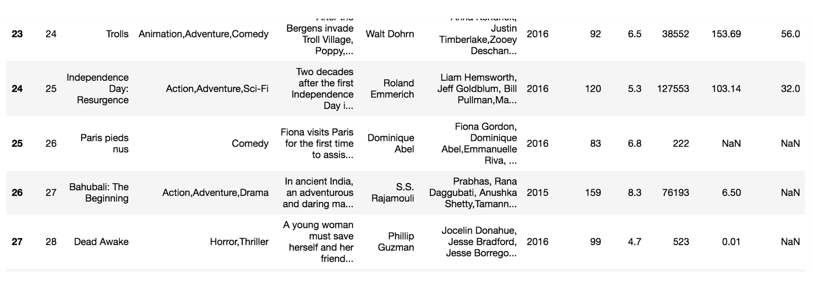
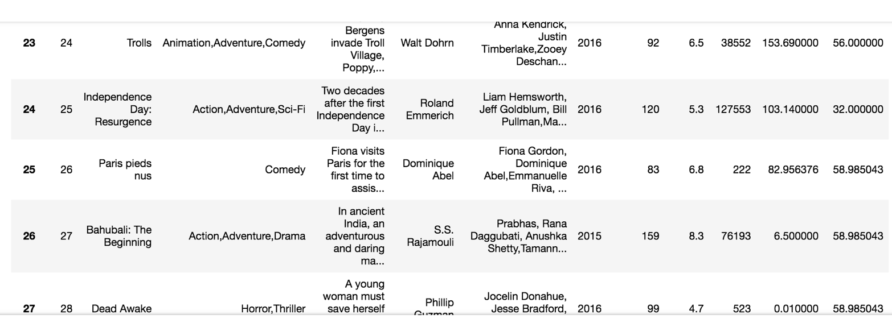
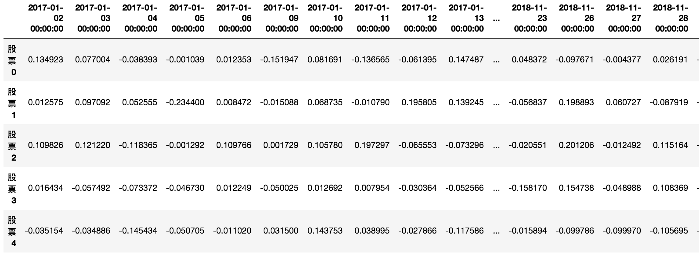
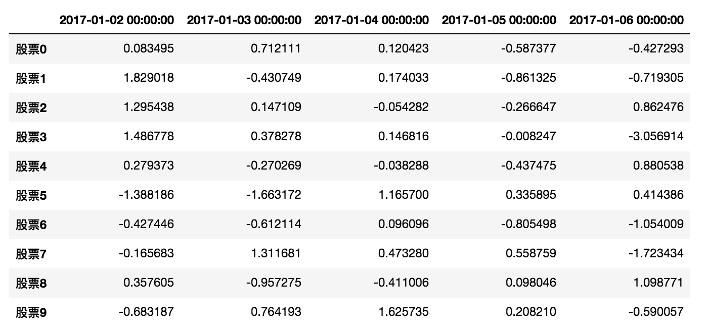
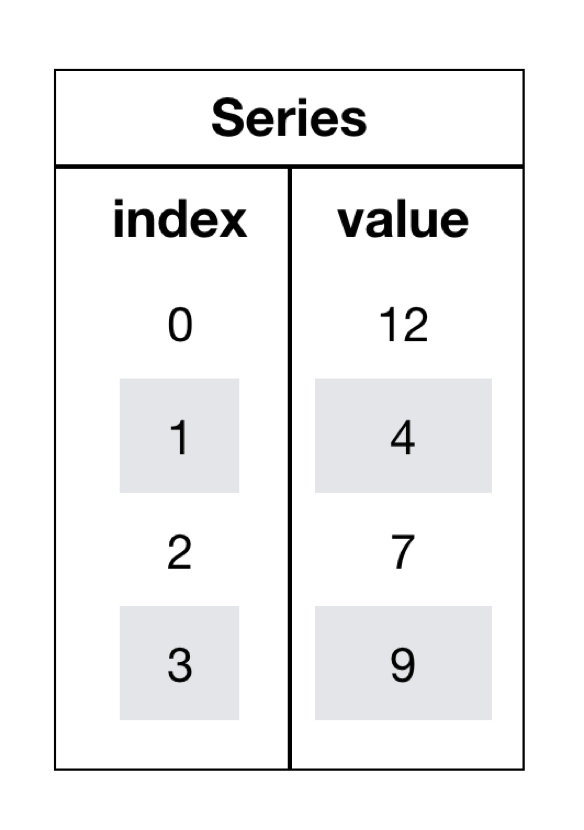

# Pandas

```python
了解Numpy与Pandas的不同
说明Pandas的Series与Dataframe两种结构的区别
了解Pandas的MultiIndex与panel结构
应用Pandas实现基本数据操作
应用Pandas实现数据的统计分析
应用Pandas实现数据的逻辑筛选
应用Pandas实现数据的算数运算
应用Pandas实现数据的缺失值处理
应用Pandas实现数据的离散化处理
应用Pandas实现数据的合并
应用crosstab和pivot_table实现交叉表与透视表
应用groupby和聚合函数实现数据的分组与聚合
了解Pandas的plot画图功能
应用Pandas实现数据的读取和存储
```

# 1、Pandas介绍

## 1.1 Pandas介绍


- 2008年WesMcKinney开发出的库
- 专门用于数据挖掘的开源python库
- **以Numpy为基础，借力Numpy模块在计算方面性能高的优势**
- **基于matplotlib，能够简便的画图**
- **独特的数据结构**

## 1.2 为什么使用Pandas

Numpy已经能够帮助我们处理数据，能够结合matplotlib解决部分数据展示等问题，那么pandas学习的目的在什么地方呢？

- **便捷的数据处理能力**





- **读取文件方便**
- **封装了Matplotlib、Numpy的画图和计算**

## 1.3 DataFrame

**回忆我们在numpy当中创建的股票涨跌幅数据形式？**

```python
# 创建一个符合正态分布的10个股票5天的涨跌幅数据
stock_change = np.random.normal(0, 1, (10, 5))

array([[-0.06544031, -1.30931491, -1.45451514,  0.57973008,  1.48602405],
       [-1.73216741, -0.83413717,  0.45861517, -0.80391793, -0.46878575],
       [ 0.21805567,  0.19901371,  0.7134683 ,  0.5484263 ,  0.38623412],
       [-0.42207879, -0.33702398,  0.42328531, -1.23079202,  1.32843773],
       [-1.72530711,  0.07591832, -1.91708358, -0.16535818,  1.07645091],
       [-0.81576845, -0.28675278,  1.20441981,  0.73365951, -0.06214496],
       [-0.98820861, -1.01815231, -0.95417342, -0.81538991,  0.50268175],
       [-0.10034128,  0.61196204, -0.06850331,  0.74738433,  0.143011  ],
       [ 1.00026175,  0.34241958, -2.2529711 ,  0.93921064,  1.14080312],
       [ 2.52064693,  1.55384756,  1.72252984,  0.61270132,  0.60888092]])
```

但是这样的数据形式很难看到存储的是什么样的数据，并且也很难获取相应的数据，比如需要获取某个指定股票的数据，就很难去获取！！

**问题：如何让数据更有意义的显示？**

```python
# 使用Pandas中的数据结构
stock_change = pd.DataFrame(stock_change)
```

**给股票涨跌幅数据增加行列索引，显示效果更佳**

效果：



- 增加行索引

```python
# 构造行索引序列
stock_code = ['股票' + str(i) for i in range(stock_change.shape[0])]

# 添加行索引
data = pd.DataFrame(stock_change, index=stock_code)
```

- 增加列索引

股票的日期是一个时间的序列，我们要实现从前往后的时间还要考虑每月的总天数等，不方便。使用pd.date_range()：用于生成一组连续的时间序列(暂时了解)

```
date_range(start=None,end=None, periods=None, freq='B')

    start:开始时间

    end:结束时间

    periods:时间天数

    freq:递进单位，默认1天,'B'默认略过周末
# 生成一个时间的序列，略过周末非交易日
date = pd.date_range('2017-01-01', periods=stock_change.shape[1], freq='B')

# index代表行索引，columns代表列索引
data = pd.DataFrame(stock_change, index=stock_code, columns=date)
```



## ——DataFrame

### 1 DataFrame结构

DataFrame对象既有行索引，又有列索引

- 行索引，表明不同行，横向索引，叫index
- 列索引，表名不同列，纵向索引，叫columns


### 2 DataFrame的属性

常用属性：

- **shape**

```python
data.shape
# 结果
(10, 5)
```

- **index**

DataFrame的行索引列表

```python
data.index

Index(['股票0', '股票1', '股票2', '股票3', '股票4', '股票5', '股票6', '股票7', '股票8', '股票9'], dtype='object')
```

- **columns**

DataFrame的列索引列表

```python
data.columns

DatetimeIndex(['2017-01-02', '2017-01-03', '2017-01-04', '2017-01-05',
               '2017-01-06'],
              dtype='datetime64[ns]', freq='B')
```

- **values**

直接获取其中array的值

```python
data.values

array([[-0.06544031, -1.30931491, -1.45451514,  0.57973008,  1.48602405],
       [-1.73216741, -0.83413717,  0.45861517, -0.80391793, -0.46878575],
       [ 0.21805567,  0.19901371,  0.7134683 ,  0.5484263 ,  0.38623412],
       [-0.42207879, -0.33702398,  0.42328531, -1.23079202,  1.32843773],
       [-1.72530711,  0.07591832, -1.91708358, -0.16535818,  1.07645091],
       [-0.81576845, -0.28675278,  1.20441981,  0.73365951, -0.06214496],
       [-0.98820861, -1.01815231, -0.95417342, -0.81538991,  0.50268175],
       [-0.10034128,  0.61196204, -0.06850331,  0.74738433,  0.143011  ],
       [ 1.00026175,  0.34241958, -2.2529711 ,  0.93921064,  1.14080312],
       [ 2.52064693,  1.55384756,  1.72252984,  0.61270132,  0.60888092]])
```

- **T**

转置

```
data.T
```

返回结果：


常用方法：

- **head(5)**：显示前5行内容

如果不补充参数，默认5行。填入参数N则显示前N行

```python
data.head(5)

2017-01-02 00:00:00    2017-01-03 00:00:00    2017-01-04 00:00:00    2017-01-05 00:00:00    2017-01-06 00:00:00
股票0    -0.065440    -1.309315    -1.454515    0.579730    1.486024
股票1    -1.732167    -0.834137    0.458615    -0.803918    -0.468786
股票2    0.218056    0.199014    0.713468    0.548426    0.386234
股票3    -0.422079    -0.337024    0.423285    -1.230792    1.328438
股票4    -1.725307    0.075918    -1.917084    -0.165358    1.076451
```

- **tail(5)**:显示后5行内容

如果不补充参数，默认5行。填入参数N则显示后N行

```python
data.tail(5)

 2017-01-02 00:00:00    2017-01-03 00:00:00    2017-01-04 00:00:00    2017-01-05 00:00:00    2017-01-06 00:00:00
股票5    -0.815768    -0.286753    1.204420    0.733660    -0.062145
股票6    -0.988209    -1.018152    -0.954173    -0.815390    0.502682
股票7    -0.100341    0.611962    -0.068503    0.747384    0.143011
股票8    1.000262    0.342420    -2.252971    0.939211    1.140803
股票9    2.520647    1.553848    1.722530    0.612701    0.608881
```

### 3 DataFrame索引的设置

- **修改行列索引值**

注意：以下修改方式是错误的

```
# 错误修改方式
data.index[3] = '股票_3'
```

正确的方式：

```python
stock_code = ["股票_" + str(i) for i in range(stock_change.shape[0])]

# 必须整体全部修改
data.index = stock_code
```

结果

```python
2017-01-02 00:00:00    2017-01-03 00:00:00    2017-01-04 00:00:00    2017-01-05 00:00:00    2017-01-06 00:00:00
股票_0    -0.065440    -1.309315    -1.454515    0.579730    1.486024
股票_1    -1.732167    -0.834137    0.458615    -0.803918    -0.468786
股票_2    0.218056    0.199014    0.713468    0.548426    0.386234
股票_3    -0.422079    -0.337024    0.423285    -1.230792    1.328438
股票_4    -1.725307    0.075918    -1.917084    -0.165358    1.076451
股票_5    -0.815768    -0.286753    1.204420    0.733660    -0.062145
股票_6    -0.988209    -1.018152    -0.954173    -0.815390    0.502682
股票_7    -0.100341    0.611962    -0.068503    0.747384    0.143011
股票_8    1.000262    0.342420    -2.252971    0.939211    1.140803
股票_9    2.520647    1.553848    1.722530    0.612701    0.608881
```

- 重设索引
  - reset_index(drop=False)
    - 设置新的下标索引
    - drop:默认为False，不删除原来索引，如果为True,删除原来的索引值

```python
# 重置索引,drop=False
data.reset_index()

    index    2017-01-02 00:00:00    2017-01-03 00:00:00    2017-01-04 00:00:00    2017-01-05 00:00:00    2017-01-06 00:00:00
0    股票_0    -0.065440    -1.309315    -1.454515    0.579730    1.486024
1    股票_1    -1.732167    -0.834137    0.458615    -0.803918    -0.468786
2    股票_2    0.218056    0.199014    0.713468    0.548426    0.386234
3    股票_3    -0.422079    -0.337024    0.423285    -1.230792    1.328438
4    股票_4    -1.725307    0.075918    -1.917084    -0.165358    1.076451
5    股票_5    -0.815768    -0.286753    1.204420    0.733660    -0.062145
6    股票_6    -0.988209    -1.018152    -0.954173    -0.815390    0.502682
7    股票_7    -0.100341    0.611962    -0.068503    0.747384    0.143011
8    股票_8    1.000262    0.342420    -2.252971    0.939211    1.140803
9    股票_9    2.520647    1.553848    1.722530    0.612701    0.608881
# 重置索引,drop=True
data.reset_index(drop=True)

2017-01-02 00:00:00    2017-01-03 00:00:00    2017-01-04 00:00:00    2017-01-05 00:00:00    2017-01-06 00:00:00
0    -0.065440    -1.309315    -1.454515    0.579730    1.486024
1    -1.732167    -0.834137    0.458615    -0.803918    -0.468786
2    0.218056    0.199014    0.713468    0.548426    0.386234
3    -0.422079    -0.337024    0.423285    -1.230792    1.328438
4    -1.725307    0.075918    -1.917084    -0.165358    1.076451
5    -0.815768    -0.286753    1.204420    0.733660    -0.062145
6    -0.988209    -1.018152    -0.954173    -0.815390    0.502682
7    -0.100341    0.611962    -0.068503    0.747384    0.143011
8    1.000262    0.342420    -2.252971    0.939211    1.140803
9    2.520647    1.553848    1.722530    0.612701    0.608881
```

- 以某列值设置为新的索引

  - set_index(keys,drop=True)

    - **keys** : 列索引名成或者列索引名称的列表
    - **drop** : boolean, default True.当做新的索引，删除原来的列

#### 设置新索引案例

- 1、创建

```python
df = pd.DataFrame({'month': [1, 4, 7, 10],
                    'year': [2012, 2014, 2013, 2014],
                    'sale':[55, 40, 84, 31]})

   month  sale  year
0  1      55    2012
1  4      40    2014
2  7      84    2013
3  10     31    2014
```

- 2、以月份设置新的索引

```python
df.set_index('month')
       sale  year
month
1      55    2012
4      40    2014
7      84    2013
10     31    2014
```

- 3、设置多个索引，以年和月份

```python
df.set_index(['year', 'month'])
            sale
year  month
2012  1     55
2014  4     40
2013  7     84
2014  10    31
```

> 注：通过刚才的设置，这样DataFrame就变成了一个具有MultiIndex的DataFrame。

## 4.1.4 MultiIndex与Panel

打印刚才的df的行索引结果

```python
df.index

MultiIndex(levels=[[2012, 2013, 2014], [1, 4, 7, 10]],
           labels=[[0, 2, 1, 2], [0, 1, 2, 3]],
           names=['year', 'month'])
```

### 1 MultiIndex

多级或分层索引对象。

- index属性
  - names：levels的名称
  - levels：每个level的元组值

```python
df.index.names
FrozenList(['year', 'month'])

df.index.levels
FrozenList([[2012, 2013, 2014], [1, 4, 7, 10]])
```

### 2 Panel

- class **pandas.Panel** (data=None,items=None,major_axis=None,minor_axis=None,copy=False,dtype=None)
  - 存储3维数组的Panel结构

```python
p = pd.Panel(np.arange(24).reshape(4,3,2),
                 items=list('ABCD'),
                 major_axis=pd.date_range('20130101', periods=3),
                 minor_axis=['first', 'second'])
p

<class 'pandas.core.panel.Panel'>
Dimensions: 4 (items) x 3 (major_axis) x 2 (minor_axis)
Items axis: A to D
Major_axis axis: 2013-01-01 00:00:00 to 2013-01-03 00:00:00
Minor_axis axis: first to second
```

- *items* - `axis 0`，每个项目对应于内部包含的数据帧(DataFrame)。
- *major_axis* - `axis 1`，它是每个数据帧(DataFrame)的索引(行)。
- *minor_axis* - `axis 2`，它是每个数据帧(DataFrame)的列。

> **注：Pandas从版本0.20.0开始弃用：推荐的用于表示3D数据的方法是DataFrame上的MultiIndex方法**

**思考：如果获取DataFrame中某个股票的不同时间数据？这样的结构是什么？**

## 4.1.5 Series

什么是Series结构呢，我们直接看下面的图：



- series结构只有行索引

我们将之前的涨跌幅数据进行转置，然后获取'股票0'的所有数据

```python
data = data.T
# series
type(data['股票_0'])
pandas.core.series.Series

# 这一步相当于是series去获取行索引的值
data['股票_0']['2017-01-02']
-0.18753158283513574
```

### 1 创建Series

通过已有数据创建

- 指定内容，默认索引

```python
pd.Series(np.arange(10))
```

- 指定索引

```python
pd.Series([6.7, 5.6, 3, 10, 2], index=[1, 2, 3, 4, 5])
```

通过字典数据创建

```python
pd.Series({'red':100, 'blue':200, 'green': 500, 'yellow':1000})
```

### 2 Series获取索引和值

- index
- values

## 4.1.6 小结

- 说明pandas的三种数据结构


