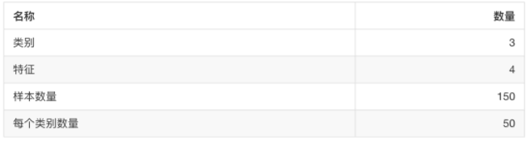
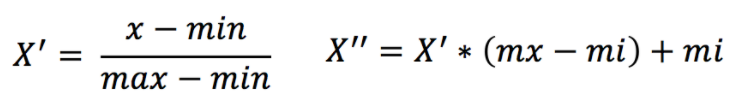
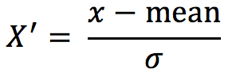
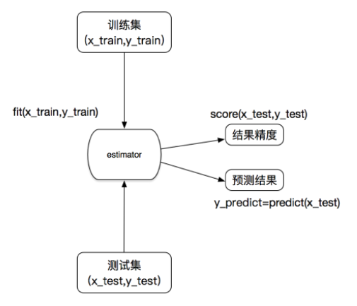

## 安装

```
pip3 install Scikit-learn==0.19.1
```

安装好之后可以通过以下命令查看是否安装成功

```python
import sklearn
```

- 注：安装scikit-learn需要Numpy, Scipy等库

## Scikit-learn包含的内容


## sklearn数据集

### scikit-learn数据集API介绍

- sklearn.datasets
  - 加载获取流行数据集
  - **datasets.load_*()**
    - 获取小规模数据集，数据包含在datasets里
  - **datasets.fetch_*(data_home=None)**
    - 获取大规模数据集，需要从网络上下载，函数的第一个参数是data_home，表示数据集下载的目录,默认是 ~/scikit_learn_data/

### sklearn小数据集

- sklearn.datasets.load_iris()

  加载并返回鸢尾花数据集



- sklearn.datasets.load_boston()

  加载并返回波士顿房价数据集


### sklearn大数据集

- sklearn.datasets.fetch_20newsgroups(data_home=None,subset=‘train’)
  - subset：'train'或者'test'，'all'，可选，选择要加载的数据集。
  - 训练集的“训练”，测试集的“测试”，两者的“全部”

**sklearn数据集返回值介绍**

- load*和 fetch*返回的数据类型datasets.base.Bunch(字典格式)
  - data：特征数据数组，是 [n_samples * n_features] 的二维 numpy.ndarray 数组
  - target：标签数组，是 n_samples 的一维 numpy.ndarray 数组
  - DESCR：数据描述
  - feature_names：特征名,新闻数据，手写数字、回归数据集没有
  - target_names：标签名

```python
from sklearn.datasets import load_iris
# 获取鸢尾花数据集
iris = load_iris()
print("鸢尾花数据集的返回值：\n", iris)
# 返回值是一个继承自字典的Bench
print("鸢尾花的特征值:\n", iris["data"])
print("鸢尾花的目标值：\n", iris.target)
print("鸢尾花特征的名字：\n", iris.feature_names)
print("鸢尾花目标值的名字：\n", iris.target_names)
print("鸢尾花的描述：\n", iris.DESCR)
```

**思考：拿到的数据是否全部都用来训练一个模型？**


### 数据集划分api

- sklearn.model_selection.train_test_split(*arrays, \**options)
  - x 数据集的特征值
  - y 数据集的标签值
  - test_size 测试集的大小，一般为float
  - random_state 随机数种子,不同的种子会造成不同的随机采样结果。相同的种子采样结果相同。
  - return 测试集特征训练集特征值值，训练标签，测试标签(默认随机取)

```python
from sklearn.datasets import load_iris
from sklearn.model_selection import train_test_split


def datasets_demo():
    """
    对鸢尾花数据集的演示
    :return: None
    """
    # 1、获取鸢尾花数据集
    iris = load_iris()
    print("鸢尾花数据集的返回值：\n", iris)
    # 返回值是一个继承自字典的Bench
    print("鸢尾花的特征值:\n", iris["data"])
    print("鸢尾花的目标值：\n", iris.target)
    print("鸢尾花特征的名字：\n", iris.feature_names)
    print("鸢尾花目标值的名字：\n", iris.target_names)
    print("鸢尾花的描述：\n", iris.DESCR)

    # 2、对鸢尾花数据集进行分割
    # 训练集的特征值x_train 测试集的特征值x_test 训练集的目标值y_train 测试集的目标值y_test
    x_train, x_test, y_train, y_test = train_test_split(iris.data, iris.target, random_state=22)
    print("x_train:\n", x_train.shape)
    # 随机数种子
    x_train1, x_test1, y_train1, y_test1 = train_test_split(iris.data, iris.target, random_state=6)
    x_train2, x_test2, y_train2, y_test2 = train_test_split(iris.data, iris.target, random_state=6)
    print("如果随机数种子不一致：\n", x_train == x_train1)
    print("如果随机数种子一致：\n", x_train1 == x_train2)

    return None
```

## 特征提取

```python
sklearn.feature_extraction
```

### 字典特征提取

**作用：对字典数据进行特征值化**

- sklearn.feature_extraction.DictVectorizer(sparse=True,…)
  - DictVectorizer.fit_transform(X) X:字典或者包含字典的迭代器返回值：返回sparse矩阵
  - DictVectorizer.inverse_transform(X) X:array数组或者sparse矩阵 返回值:转换之前数据格式
  - DictVectorizer.get_feature_names() 返回类别名称

### 文本特征提取

**作用：对文本数据进行特征值化**

- **sklearn.feature_extraction.text.CountVectorizer(stop_words=[])**
  - 返回词频矩阵

- CountVectorizer.fit_transform(X) X:文本或者包含文本字符串的可迭代对象 返回值：返回sparse矩阵
- CountVectorizer.inverse_transform(X) X:array数组或者sparse矩阵 返回值:转换之前数据格
- CountVectorizer.get_feature_names() 返回值:单词列表

- **sklearn.feature_extraction.text.TfidfVectorizer**


不支持对单个中文字的分词，要达到分词结果，可以用**jieba**分词处理。

### jieba分词处理

- jieba.cut()
  - 返回词语组成的生成器

需要安装下jieba库

```python
pip3 install jieba
```

结巴分词结果是不能直接用于分类的。因为要排除某个词语在多篇文章中出现次数高的情况，这时需要用到**TF-IDF文本特征提取**。

### TF-IDF文本特征提取

- TF-IDF的主要思想是：如果**某个词或短语在一篇文章中出现的概率高，并且在其他文章中很少出现**，则认为此词或者短语具有很好的类别区分能力，适合用来分类。
- **TF-IDF作用：用以评估一字词对于一个文件集或一个语料库中的其中一份文件的重要程度。**

**公式**

- 词频（term frequency，tf）指的是某一个给定的词语在该文件中出现的频率
- 逆向文档频率（inverse document frequency，idf）是一个词语普遍重要性的度量。某一特定词语的idf，可以**由总文件数目除以包含该词语之文件的数目，再将得到的商取以10为底的对数得到**


最终得出结果可以理解为重要程度。

## 特征预处理

特征预处理是通过**一些转换函数**将特征数据**转换成更加适合算法模型**的特征数据过程。

- 数值型数据的无量纲化：
  - 归一化
  - 标准化

### 特征预处理API

```python
sklearn.preprocessing
```

为什么我们要进行归一化/标准化？

- 特征的**单位或者大小相差较大，或者某特征的方差相比其他的特征要大出几个数量级**，**容易影响（支配）目标结果**，使得一些算法无法学习到其它的特征

### 归一化

通过对原始数据进行变换把数据映射到(默认为[0,1])之间。



> 作用于每一列，max为一列的最大值，min为一列的最小值,那么X’’为最终结果，mx，mi分别为指定区间值默认mx为1,mi为0

**API:**

sklearn.**preprocessing.MinMaxScaler** (feature_range=(0,1)… )

- MinMaxScalar.fit_transform(X)
  - X:numpy array格式的数据[n_samples,n_features]
- 返回值：转换后的形状相同的array

注意最大值最小值是变化的，另外，最大值与最小值非常容易受异常点影响，**所以这种方法鲁棒性较差，只适合传统精确小数据场景。**

怎么办？

### 标准化

通过对原始数据进行变换把数据变换到均值为0,标准差为1范围内。



> 作用于每一列，mean为平均值，σ为标准差

- 对于归一化来说：如果出现异常点，影响了最大值和最小值，那么结果显然会发生改变
- 对于标准化来说：如果出现异常点，由于具有一定数据量，少量的异常点对于平均值的影响并不大，从而方差改变较小。

**API**

- sklearn.**preprocessing.StandardScaler**( )
  - 处理之后每列来说所有数据都聚集在均值0附近，标准差为1
  - StandardScaler.fit_transform(X)
    - X:numpy array格式的数据[n_samples,n_features]
  - 返回值：转换后的形状相同的array

标准化在已有样本足够多的情况下比较稳定，适合现代嘈杂大数据场景。

## 特征降维

**降维**是指在某些限定条件下，**降低随机变量(特征)个数**，得到**一组“不相关”主变量**的过程。

降维的2种方式：**特征选择、主成分分分析**（可以理解成一种特征提取的方式）

### 特征选择

数据中包含**冗余或无关变量（或称特征、属性、指标等）**，旨在从**原有特征中找出主要特征**。

#### 方法

- Filter(过滤式)：主要探究特征本身特点、特征与特征和目标值之间关联
  - **方差选择法：低方差特征过滤**
  - **相关系数**
- Embedded (嵌入式)：算法自动选择特征（特征与目标值之间的关联）
  - **决策树：信息熵、信息增益**
  - **正则化：L1、L2**
  - **深度学习：卷积等**

> 对于Embedded方式，只能在讲解算法的时候在进行介绍，更好的去理解

#### 模块

```python
sklearn.feature_selection
```

#### 过滤式

##### 低方差特征过滤

删除低方差的一些特征，前面讲过方差的意义。再结合方差的大小来考虑这个方式的角度。

- 特征方差小：某个特征大多样本的值比较相近
- 特征方差大：某个特征很多样本的值都有差别

**API**

- sklearn.**feature_selection.VarianceThreshold**(threshold = 0.0)
  - 删除所有低方差特征
  - Variance.fit_transform(X)
    - X:numpy array格式的数据[n_samples,n_features]
    - 返回值：训练集差异低于threshold的特征将被删除。默认值是保留所有非零方差特征，即删除所有样本中具有相同值的特征。

##### 相关系数

皮尔逊相关系数(Pearson Correlation Coefficient)

- 反映变量之间相关关系密切程度的统计指标

- 公式


**特点：**

**相关系数的值介于–1与+1之间，即–1≤ r ≤+1**。其性质如下：

- **当r>0时，表示两变量正相关，r<0时，两变量为负相关**
- 当|r|=1时，表示两变量为完全相关，当r=0时，表示两变量间无相关关系
- **当0<|r|<1时，表示两变量存在一定程度的相关。且|r|越接近1，两变量间线性关系越密切；|r|越接近于0，表示两变量的线性相关越弱**
- **一般可按三级划分：|r|<0.4为低度相关；0.4≤|r|<0.7为显著性相关；0.7≤|r|<1为高度线性相关**

**API：**

- from scipy.stats import pearsonr
  - x : (N,) array_like
  - y : (N,) array_like Returns: (Pearson’s correlation coefficient, p-value)

### 主成分分析PCA

```python
from sklearn.decomposition import PCA
```

- 定义：**高维数据转化为低维数据的过程**，在此过程中**可能会舍弃原有数据、创造新的变量**
- 作用：**是数据维数压缩，尽可能降低原数据的维数（复杂度），损失少量信息。**
- 应用：回归分析或者聚类分析当中

**API**

- sklearn.**decomposition.PCA**(n_components=None)
  - 将数据分解为较低维数空间
  - n_components:
    - **小数：表示保留百分之多少的信息**
    - **整数：减少到多少特征**
  - PCA.fit_transform(X) X:numpy array格式的数据[n_samples,n_features]
  - 返回值：转换后指定维度的array


## sklearn转换器和估计器

### 转换器

想一下之前做的特征工程的步骤？

- 1 实例化 (实例化的是一个转换器类(Transformer))
- 2 调用fit_transform(对于文档建立分类词频矩阵，不能同时调用)

我们把特征工程的接口称之为转换器，其中转换器调用有这么几种形式

- fit_transform
- fit
- transform

### 估计器

在sklearn中，估计器(estimator)是一个重要的角色，是一类实现了算法的API。

- 用于分类的估计器：
  - sklearn.neighbors：k-近邻算法
  - sklearn.naive_bayes：贝叶斯
  - sklearn.linear_model.LogisticRegression：逻辑回归
  - sklearn.tree：决策树与随机森林
- 用于回归的估计器：
  - sklearn.linear_model.LinearRegression：线性回归
  - sklearn.linear_model.Ridge：岭回归
- 用于无监督学习的估计器：
  - sklearn.cluster.KMeans：聚类

**估计器工作流程：**

- 实例化估计器

- 调用估计器的fit函数, 用训练集的特征值和目标值训练

- 调用预测函数predict, 用测试集的特征值预测



## 模型选择与调优API

- sklearn.**model_selection.GridSearchCV**(estimator, param_grid=None,cv=None)

  - 对估计器的指定参数值进行详尽搜索
  - estimator：估计器对象
  - param_grid：估计器参数(dict){“n_neighbors”:[1,3,5]}
  - cv：指定几折交叉验证


  - fit：输入训练数据
  - score：准确率
  - 结果分析：
    - best*score*:在交叉验证中验证的最好结果_
    - best*estimator*：最好的参数模型
    - cv*results*:每次交叉验证后的验证集准确率结果和训练集准确率结果

```python
# 模型选择与调优
# 1、获取数据集
facebook = pd.read_csv("./FBlocation/train.csv")

# 2、基本的数据处理，拿到特征值和目标值
# 1）缩小数据范围
facebook = facebook.query("x > 1.0 & x <1.25 & y > 2.0 & y < 2.25")
# 2）选取有用的时间特征
time_value = pd.to_datetime(facebook["time"], unit="s")
time_value = pd.DatetimeIndex(time_value)
facebook["day"] = time_value.day
facebook["hour"] = time_value.hour
facebook["weekday"] = time_value.weekday
# 3）去掉签到较少的地点
place_count = facebook.groupby("place_id").count()
place_count = place_count[place_count["row_id"] > 3]
facebook = facebook[facebook["place_id"].isin(place_count.index)]

# 4）拿到特征值x和目标值y
x = facebook[["x", "y", "accuracy", "day", "hour", "weekday"]]
y = facebook["place_id"]

# 3、数据集的划分
x_train, x_test, y_train, y_test = train_test_split(x, y, random_state=6)

# 4、特征工程：标准化
transfer = StandardScaler()
x_train = transfer.fit_transform(x_train)
x_test = transfer.transform(x_test)

# 5、KNN预估器流程
estimator = KNeighborsClassifier()

# 6、模型评估
# 方法1：比对真实值和预测值
y_predict = estimator.predict(x_test)
print("预测结果为:\n", y_predict)
print("比对真实值和预测值：\n", y_predict == y_test)
# 方法2：直接计算准确率
score = estimator.score(x_test, y_test)
print("准确率为：\n", score)

# 7、交叉验证和网格搜索的结果
print("在交叉验证中验证的最好结果:\n", estimator.best_score_)
print("最好的参数模型:\n", estimator.best_estimator_)
print("每次交叉验证后的准确率结果:\n", estimator.cv_results_)
```


## 算法API

### K-近邻

- sklearn.**neighbors.KNeighborsClassifier**(n_neighbors=5,algorithm='auto')
  - n_neighbors：int,可选（默认= 5），k_neighbors查询默认使用的邻居数
  - algorithm：{‘auto’，‘ball_tree’，‘kd_tree’，‘brute’}，可选用于计算最近邻居的算法：‘ball_tree’将会使用 BallTree，‘kd_tree’将使用 KDTree。‘auto’将尝试根据传递给fit方法的值来决定最合适的算法。 (不同实现方式影响效率)

### 朴素贝叶斯

- sklearn.**naive_bayes.MultinomialNB**(alpha = 1.0)
  - 朴素贝叶斯分类
  - alpha：拉普拉斯平滑系数

### 决策树

- class sklearn.**tree.DecisionTreeClassifier**(criterion=’gini’, max_depth=None,random_state=None)
  - 决策树分类器
  - criterion:默认是’gini’系数，也可以选择信息增益的熵’entropy’
  - max_depth:树的深度大小
  - random_state:随机数种子

**保存树的结构到dot文件：**

- sklearn.tree.**export_graphviz**() 该函数能够导出DOT格式
  - tree.export_graphviz(estimator,out_file='tree.dot’,feature_names=[‘’,’’])

### 随机森林

- class sklearn.**ensemble.RandomForestClassifier**(n_estimators=10, criterion=’gini’, max_depth=None, bootstrap=True, random_state=None, min_samples_split=2)
  - 随机森林分类器
  - n_estimators：integer，optional（default = 10）森林里的树木数量120,200,300,500,800,1200
  - criteria：string，可选（default =“gini”）分割特征的测量方法
  - max_depth：integer或None，可选（默认=无）树的最大深度 5,8,15,25,30
  - max_features="auto”,每个决策树的最大特征数量
    - If "auto", then `max_features=sqrt(n_features)`.
    - If "sqrt", then `max_features=sqrt(n_features)` (same as "auto").
    - If "log2", then `max_features=log2(n_features)`.
    - If None, then `max_features=n_features`.
  - bootstrap：boolean，optional（default = True）是否在构建树时使用放回抽样
  - min_samples_split:节点划分最少样本数
  - min_samples_leaf:叶子节点的最小样本数
- 超参数：n_estimator, max_depth, min_samples_split,min_samples_leaf

### 线性回归

- sklearn.**linear_model.LinearRegression**(fit_intercept=True)
  - 通过正规方程优化
  - fit_intercept：是否计算偏置
  - LinearRegression.coef_：回归系数
  - LinearRegression.intercept_：偏置
- sklearn.**linear_model.SGDRegressor**(loss="squared_loss", fit_intercept=True, learning_rate ='invscaling', eta0=0.01)
  - SGDRegressor类实现了随机梯度下降学习，它支持不同的**loss函数和正则化惩罚项**来拟合线性回归模型。
  - loss:损失类型
    - **loss=”squared_loss”: 普通最小二乘法**
  - fit_intercept：是否计算偏置
  - learning_rate : string, optional
    - 学习率填充
    - **'constant': eta = eta0**
    - **'optimal': eta = 1.0 / (alpha \* (t + t0)) [default]**
    - 'invscaling': eta = eta0 / pow(t, power_t)
      - **power_t=0.25:存在父类当中**
    - **对于一个常数值的学习率来说，可以使用learning_rate=’constant’ ，并使用eta0来指定学习率。**
  - SGDRegressor.coef_：回归系数
  - SGDRegressor.intercept_：偏置

> sklearn提供给我们两种实现的API， 可以根据选择使用

**回归性能评估：**

- sklearn.**metrics.mean_squared_error**(y_true, y_pred)
  - 均方误差回归损失
  - y_true:真实值
  - y_pred:预测值
  - return:浮点数结果

- 文字对比

| 梯度下降             | 正规方程                        |
| -------------------- | ------------------------------- |
| 需要选择学习率       | 不需要                          |
| 需要迭代求解         | 一次运算得出                    |
| 特征数量较大可以使用 | 需要计算方程，时间复杂度高O(n3) |

- 选择：
  - 小规模数据：
    - **LinearRegression(不能解决拟合问题)**
    - 岭回归
  - 大规模数据：SGDRegressor

#### 岭回归

- sklearn.**linear_model.Ridge**(alpha=1.0, fit_intercept=True,solver="auto", normalize=False)
  - 具有l2正则化的线性回归
  - alpha:正则化力度，也叫 λ
    - **λ取值：0~1 1~10**
  - solver:会根据数据自动选择优化方法
    - **sag:如果数据集、特征都比较大，选择该随机梯度下降优化**
  - normalize:数据是否进行标准化
    - normalize=False:可以在fit之前调用preprocessing.StandardScaler标准化数据
  - Ridge.coef_:回归权重
  - Ridge.intercept_:回归偏置

**Ridge方法相当于SGDRegressor(penalty='l2', loss="squared_loss"),只不过SGDRegressor实现了一个普通的随机梯度下降学习，推荐使用Ridge(实现了SAG)**

- sklearn.**linear_model.RidgeCV**(_BaseRidgeCV, RegressorMixin)
  - 具有l2正则化的线性回归，可以进行交叉验证
  - coef_:回归系数

```python
class _BaseRidgeCV(LinearModel):
    def __init__(self, alphas=(0.1, 1.0, 10.0),
                 fit_intercept=True, normalize=False, scoring=None,
                 cv=None, gcv_mode=None,
                 store_cv_values=False):
```


### 逻辑回归

- sklearn.**linear_model.LogisticRegression**(solver='liblinear', penalty=‘l2’, C = 1.0)
  - solver:优化求解方式（默认开源的liblinear库实现，内部使用了坐标轴下降法来迭代优化损失函数）
    - sag：根据数据集自动选择，随机平均梯度下降
  - penalty：正则化的种类
  - C：正则化力度

> **默认将类别数量少的当做正例**

**LogisticRegression方法相当于 SGDClassifier(loss="log", penalty=" "),SGDClassifier实现了一个普通的随机梯度下降学习，也支持平均随机梯度下降法（ASGD），可以通过设置average=True。而使用LogisticRegression(实现了SAG)**


### 分类评估报告API

- sklearn.**metrics.classification_report**(y_true, y_pred, labels=[], target_names=None )
  - y_true：真实目标值
  - y_pred：估计器预测目标值
  - labels:指定类别对应的数字
  - target_names：目标类别名称
  - return：每个类别精确率与召回率

```python
print("精确率和召回率为：", classification_report(y_test, lr.predict(x_test), labels=[2, 4], target_names=['良性', '恶性']))
```

#### AUC计算API

- from sklearn.metrics import roc_auc_score
  - sklearn.**metrics.roc_auc_score**(y_true, y_score)
    - 计算ROC曲线面积，即AUC值
    - y_true：每个样本的真实类别，必须为0(反例),1(正例)标记
    - y_score：预测得分，可以是正类的估计概率、置信值或者分类器方法的返回值

```python
# 0.5~1之间，越接近于1约好
y_test = np.where(y_test > 2.5, 1, 0)

print("AUC指标：", roc_auc_score(y_test, lr.predict(x_test)))
```


### K-means

- sklearn.cluster.KMeans(n_clusters=8,init=‘k-means++’)
  - k-means聚类
  - n_clusters:开始的聚类中心数量
  - init:初始化方法，默认为'k-means ++’
  - labels_:默认标记的类型，可以和真实值比较（不是值比较）

#### #### K-means性能评估

**轮廓系数API**

- sklearn.metrics.silhouette_score(X, labels)
  - 计算所有样本的平均轮廓系数
  - X：特征值
  - labels：被聚类标记的目标值


## sklearn模型的保存和加载API

- from sklearn.externals import joblib
  - 保存：joblib.dump(rf, 'test.pkl')
  - 加载：estimator = joblib.load('test.pkl')