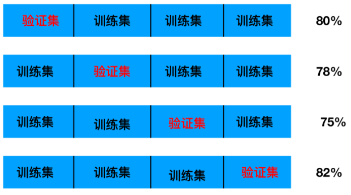

## 什么是交叉验证(cross validation)

交叉验证：将拿到的训练数据，分为训练和验证集。以下图为例：将数据分成5份，其中一份作为验证集。然后经过5次(组)的测试，每次都更换不同的验证集。即得到5组模型的结果，取平均值作为最终结果。又称5折交叉验证。

数据分为训练集和测试集，但是**为了让从训练得到模型结果更加准确。**做以下处理：

- 训练集：训练集+验证集
- 测试集：测试集

交叉验证目的：**为了让被评估的模型更加准确可信**

问题：那么这个只是对于参数得出更好的结果，那么怎么选择或者调优参数呢？

## 超参数搜索-网格搜索(Grid Search)

通常情况下，**有很多参数是需要手动指定的（如k-近邻算法中的K值），这种叫超参数**。但是手动过程繁杂，所以需要对模型预设几种超参数组合。**每组超参数都采用交叉验证来进行评估。最后选出最优参数组合建立模型。**

