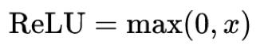
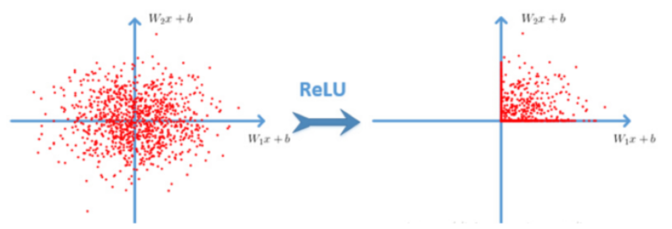

卷积神经网络CNN，在原来多层神经网络的基础上，加入了更加有效的特征学习部分，具体操作就是在原来的全连接层前面加入了**卷积层**与**池化层**。**卷积神经网络出现，使得神经网络层数得以加深，“深度”学习由此而来。**

## 卷积神经网络三个结构

神经网络(neural networks)的基本组成包括输入层、隐藏层、输出层。

而卷积神经网络的特点在于隐藏层分为**卷积层**和**池化层**(pooling layer，又叫下采样层)以及**激活层**。每一层的作用：

- **卷积层**：通过在原始图像上平移来提取特征；
- **激活层**：增加非线性分割能力；
- **池化层**：减少学习的参数，降低网络的复杂度（最大池化和平均池化）

为了能够达到分类效果，还会有一个**全连接层(Full Connection)**也就是最后的输出层，进行损失计算并输出分类结果。

## 卷积层（Convolutional Layer）

**卷积神经网络中每层卷积层由若干卷积单元(卷积核)组成**，每个卷积单元的参数都是通过反向传播算法最佳化得到的。

卷积运算的目的是**特征提取**，第一层卷积层可能只能提取一些低级的特征如边缘、线条和角等层级，更多层的网络能从低级特征中迭代提取更复杂的特征。

### 1、卷积核(Filter)的四大要素

- 卷积核个数
- 卷积核大小
- 卷积核步长
- 卷积核零填充大小

### 2、卷积如何计算-大小

卷积核我们可以理解为一个观察的人，**带着若干权重和一个偏置**去观察，进行特征加权运算。

> 注：上述要加上偏置

- 卷积核大小
  - 1\*1、3\*3、5\*5

**通常卷积核大小选择这些大小，是经过研究人员实验证明比较好的效果。**这个人观察之后会得到一个运算结果.

### 3、卷积如何计算-步长

需要去平移卷积核观察图片，此时需要的参数就是**步长**。

> 5x5的图片，3x3的卷积大小，如果通过**一个**步长运算得到3x3的大小；如果通过**2个**步长运算得到2x2的大小。

### 4、卷积如何计算-卷积核个数

那么如果在某一层结构当中，不止是一个人观察，多个人(卷积核)一起去观察。那就得到多张观察结果。

- 不同的卷积核带的权重和偏置都不一样，即随机初始化的参数

**我们已经得出输出结果的大小由大小和步长决定的，但是只有这些吗？**

还有一个就是零填充。Filter观察窗口的大小和移动步长有时会导致**超过图片像素宽度**！

### 5、卷积如何计算-零填充大小

零填充就是在图片像素外围填充一圈值为0的像素。

### 6、总结-输出大小计算公式

如果已知输入图片形状，卷积核数量，卷积核大小，以及移动步长，那么输出图片形状如何确定？

**卷积向下取整，池化向上取整。**

计算案例：

> 1、假设已知的条件：输入图像32*32*1, 50个Filter，大小为5*5，移动步长为1，零填充大小为1。请求出输出大小？
>
> H2 = (H1 - F + 2P)/S + 1 = (32 - 5 + 2 * 1)/1 + 1 = 30
>
> W2 = (H1 - F + 2P)/S + 1 = (32 -5 + 2 * 1)/1 + 1 = 30
>
> D2 = K = 50
>
> 所以输出大小为[30, 30, 50]
>
>
>
> 2、假设已知的条件：输入图像32*32*1, 50个Filter，大小为3*3，移动步长为1，未知零填充。输出大小32*32？
>
> H2 = (H1 - F + 2P)/S + 1 = (32 - 3 + 2 * P)/1 + 1 = 32
>
> W2 = (H1 - F + 2P)/S + 1 = (32 -3 + 2 * P)/1 + 1 = 32
>
> 所以零填充大小为：1*1

### 7、多通道图片如何观察

如果是一张彩色图片，那么就有三种表分别为R，G，B。**原本每个人需要带一个3x3或者其他大小的卷积核，现在需要带3张3x3的权重和一个偏置，总共就27个权重。**最终每个人还是得出一张结果：

## 激活函数

随着神经网络的发展，大家发现原有的sigmoid等激活函数并不能达到好的效果，所以采取新的激活函数（Relu、Tanh、sigmoid）。

- Relu

效果是什么样的呢？

- Relu优点
  - **有效解决梯度爆炸问题**
  - 计算速度非常快，只需要判断输入是否大于0。SGD(批梯度下降)的求解速度速度远快于sigmoid和tanh
- sigmoid缺点
  - 采用sigmoid等函数，计算量相对大，而采用Relu激活函数，整个过程的计算量节省很多。在深层网络中，sigmoid函数 反向传播 时，很容易就会出现梯度消失的情况

## 池化层(Polling)

Pooling层主要的作用是特征提取，通过去掉Feature Map中不重要的样本，进一步减少参数数量。Pooling的方法很多，通常采用最大池化

- max_polling:取池化窗口的最大值
- avg_polling:取池化窗口的平均值

池化层也有窗口的大小以及移动步长，那么之后的输出大小怎么计算？计算公式同卷积计算公式一样

> 计算：224x224x64,窗口为2，步长为2输出结果？
>
> H2 = (224 - 2 + 2*0)/2 +1 = 112
>
> w2 = (224 - 2 + 2*0)/2 +1 = 112

通常池化层采用 **2x2大小、步长为2**窗口。

## 全连接层(Full Connection)

前面的卷积和池化相当于做特征工程，最后的全连接层在整个卷积神经网络中起到“**分类器**”的作用。

## 卷积神经网络总结

## 卷积网络用途

- 图像目标检测
  - Yolo：GoogleNet+ bounding boxes
  - SSD：VGG + region proposals
  - Faster-RCNN：VGG，ResNet

## 网络结构优化

梯度下降优化器容易发生梯度爆炸现象，所以对于深度学习来说会去使用改进版本的优化器，如Adam优化等。

- 初始参数大小调整

  - 模型参数的大小缩小

- 使用改进版SGD算法

  最朴素的优化算法就是SGD了，梯度下降算法效果也很好，但选择一个合理的学习速率很难，容易陷入那些次优的局部极值点中。

  相比随机梯度下降，Adam优化速度快很多，但是需要设置更小的学习率。

    **拓展内容（了解）：**
    > 
    - **SGD with Momentum**
    **梯度更新规则:**Momentum在梯度下降的过程中加入了惯性，使得梯度方向不变的维度上速度变快，梯度方向有所改变的维度上的更新速度变慢，这样就可以加快收敛并减小震荡。
    - **RMSProp**
    **梯度更新规则:**解决Adagrad学习率急剧下降的问题，RMSProp改变了二阶动量计算方法，即用窗口滑动加权平均值计算二阶动量。
    - **Adam**
    **梯度更新规则:**Adam = Adaptive + Momentum，顾名思义Adam集成了SGD的一阶动量和RMSProp的二阶动量。

- 对于深度网络使用batch normalization或者droupout层

  - 目的：**提高网络泛化能力，防止过拟合**。
    - BN(Batch Normalization)也属于网络的一层，又称为归一化层。
    - 在一些大型网络当中使用Droupout，使得部分比例神经元失效。

