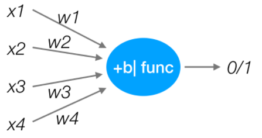
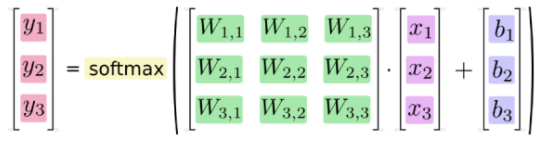
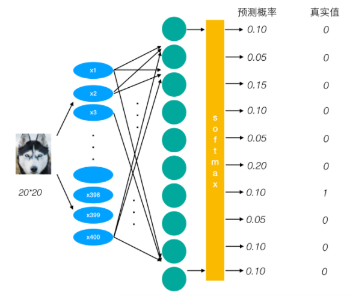

**人工神经网络（ Artificial Neural Network， 简写为ANN）也简称为神经网络（NN）**。是一种模仿生物神经网络（动物的中枢神经系统，特别是大脑）结构和功能的 **计算模型**。经典的神经网络结构包含三个层次的神经网络，**分别为输入层，输出层以及隐藏层。**

**其中每层的圆圈代表一个神经元，隐藏层和输出层的神经元有输入的数据计算后输出，输入层的神经元只是输入。**

- 神经网络的特点
  - 每个连接都有个权值
  - 同一层神经元之间没有连接
  - 最后的输出结果对应的层也称之为**全连接层**

那么为什么设计这样的结构呢？首先从一个最基础的结构说起，神经元。以前也称之为感知机。神经元就是要模拟人的神经元结构。

> 一个神经元通常具有多个**树突**，主要用来接受传入信息；而**轴突**只有一条，轴突尾端有许多轴突末梢可以给其他多个神经元传递信息。轴突末梢跟其他神经元的树突产生连接，从而传递信号。这个连接的位置在生物学上叫做“**突触**”。

### 感知机(PLA: Perceptron Learning Algorithm))

感知机就是模拟这样的大脑神经网络处理数据的过程。感知机模型如下图：

感知机是一种最基础的分类模型，类似于逻辑回归，不同的是，感知机的激活函数用的是sign，而逻辑回归用的sigmoid。**感知机也具有连接的权重和偏置**

**神经网络解决多分类问题最常用的方法是设置n个输出节点，其中n为类别的个数。**

## softmax回归

Softmax回归（激活函数）将神经网络输出转换成概率结果。

类似于逻辑回归当中的sigmoid函数，sigmoid输出的是某个类别的概率。

想一想线性回归的损失函数以及逻辑回归的损失函数，那么如何去衡量神经网络预测的概率分布和真实答案的概率分布之间的距离？

## 交叉熵损失

为了能够衡量距离，目标值需要进行one-hot编码，能与概率值一一对应，如下图

最后的损失为每个样本损失大小的平均值。

- sotfmax交叉熵适合于计算**类别相互排斥**的离散分类任务的损失值，每个输出对应一个类别。

  比如CIFAR-10图像都标**有一个且仅有一个标签**，只能是10个类别中的一种。

- sigmoid交叉熵适合计算**每个类别独立且不互相排斥**的离散分类任务中的损失值。

  例如，可以执行**多标签分类**，其中图片可以同时包含大象和狗。

## 线性神经网络的局限性
**多层的线性网络和单层的线性网络没有区别，而且线性模型的能够解决的问题也是有限的**。

一个单隐含层有更多的神经元，就能捕捉更多的特征。而且有更多隐层，意味着能从数据集中提取更多复杂的结构。

- 神经网络具有不可解释性（黑盒）。

- 训练深度神经网络需要大量的算力。

- 需要大量的训练数据集。一个强力的 GPU 服务器可能要花费数天、甚至数周的时间，才能使用数百万张图像的数据集训练出一个深度网络。而且，为了得到最好的训练结果，需要结合不同的网络设计与算法，并进行大量的试错。

**神经网络的种类：**

- 基础神经网络：线性神经网络，BP神经网络，Hopfield神经网络等
- 进阶神经网络：玻尔兹曼机，受限玻尔兹曼机，递归神经网络等
- 深度神经网络：深度置信网络，卷积神经网络，循环神经网络，LSTM网络等

